---  
title: 📘 Sesión 1- Fundamentos y Control Básico 
description: Curso avanzado de Arduino dividido edss  
---

## 📚 Contenido del Curso de Arduino

1. [Introducción a Arduino](#-introducción-a-arduino)  
2. [Configuración del entorno de desarrollo](#-configuración-del-entorno-de-desarrollo)  
3. [Programación gráfica en Arduino](#-programación-gráfica-en-arduino)  
4. [Lección 1: Cómo encender el LED intermitente](#-lección-1-cómo-encender-el-led-intermitente)  
5. [Lección 2: Aplicación del zumbador activo](#-lección-2-aplicación-del-zumbador-activo)  
6. [Lección 3: Controlar un LED con un botón](#-lección-3-controlar-un-led-con-un-botón)  
7. [Lección 4: Controlar un LED con un módulo de relé](#-lección-4-controlar-un-led-con-un-módulo-de-relé)  
8. [Lección 5: Controlar un LED con un potenciómetro](#%EF%B8%8F-lección-5-controlar-un-led-con-un-potenciómetro)  
9. [Lección 6: Crear un LED secuencial con LED](#-lección-6-crear-un-efecto-de-led-fluido-flowing-led)  
10. [Lección 7: Controlar una barra de LED con un potenciómetro](#%EF%B8%8F-lección-7-controlar-una-barra-de-leds-con-un-potenciómetro)  
11. [Lección 8: Crear un LED respiratorio](#%EF%B8%8F-lección-7-controlar-una-barra-de-leds-con-un-potenciómetro)


## 📘 Introducción a Arduino

Arduino es una plataforma de prototipado electrónico de código abierto basada en hardware y software fáciles de usar. Se utiliza ampliamente para aprender electrónica, crear prototipos y desarrollar proyectos interactivos.

---
## 💻 Configuración del entorno de desarrollo

Para programar Arduino, necesitas:

- Descargar e instalar el **Arduino IDE** desde [https://www.arduino.cc](https://www.arduino.cc)
- Conectar tu placa Arduino a la computadora mediante USB
- Seleccionar la placa y el puerto en el IDE
- Cargar un programa de ejemplo y subirlo a la placa

---

## 🎨 Programación gráfica en Arduino

Existen herramientas como **Tinkercad Circuits** o **mBlock** que permiten programar Arduino usando bloques visuales. Esto facilita el aprendizaje sin necesidad de escribir código al principio.


## 🔌 Lección 1: Cómo encender el LED intermitente

### 📘 Descripción
En esta lección, aprenderemos cómo encender un LED intermitente. El LED se encenderá y apagará en un bucle, demostrando un uso básico de la salida digital en la programación con Arduino.

---

### 🧰 Componentes utilizados
- 1x Arduino UNO  
- 1x LED  
- 1x Resistencia de 220Ω  
- Cables de conexión  
- Protoboard  

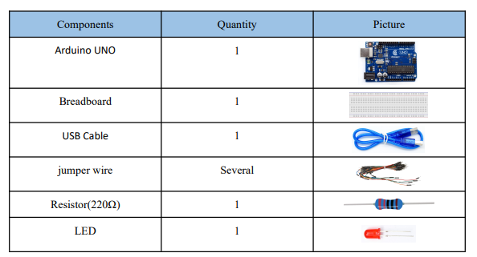

---

### 🔧 Diagrama de conexión (Circuit Diagram)

El LED se conecta al pin digital 8 de Arduino a través de una resistencia de 220Ω, y el cátodo (pata corta) del LED a GND.

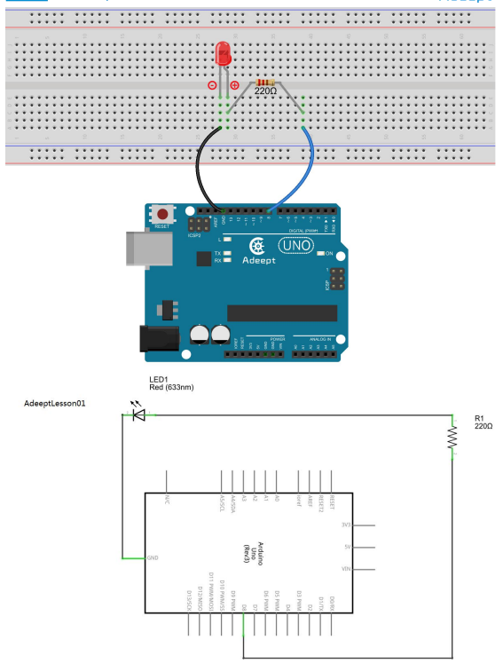

---

### 📸 Diagrama físico

Este es el montaje real en protoboard para comprobar la conexión correcta del LED.

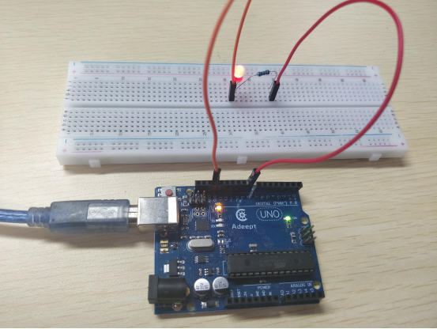

---

### 💡 Funcionamiento

Al observar el LED conectado al pin 8, se encenderá durante 1 segundo, se apagará durante 1 segundo, y repetirá ese ciclo de forma continua, lo que indica que la prueba experimental es exitosa.

---

### 💻 Código base explicado

Este es el código en lenguaje C para Arduino UNO. Se define el pin, se configura como salida, y se alterna su estado entre encendido y apagado con una pausa de 1 segundo entre cada estado.

```cpp
// Declaración del pin donde está conectado el LED
int ledPin = 8;

void setup() {
  // Configurar el pin como salida
  pinMode(ledPin, OUTPUT);
}

void loop() {
  // Encender el LED
  digitalWrite(ledPin, HIGH);
  // Esperar 1 segundo (1000 milisegundos)
  delay(1000);

  // Apagar el LED
  digitalWrite(ledPin, LOW);
  // Esperar 1 segundo
  delay(1000);
}
```
## 🔊 Lección 2: Aplicación del Zumbador Activo

### 📘 Descripción
En esta lección, estudiaremos la aplicación del zumbador activo. El zumbador se activará y desactivará en intervalos de tiempo, demostrando cómo utilizar salidas digitales para generar sonido.

---

### 🧰 Componentes utilizados
- 1x Arduino UNO  
- 1x Zumbador activo  
- Cables de conexión  
- Protoboard  

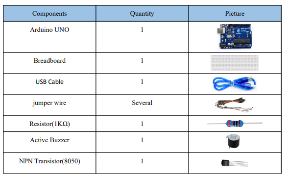

---

### 🔧 Diagrama de conexión (Circuit Diagram)

El pin positivo del zumbador activo se conecta al pin digital 8 del Arduino UNO, y el pin negativo a GND.

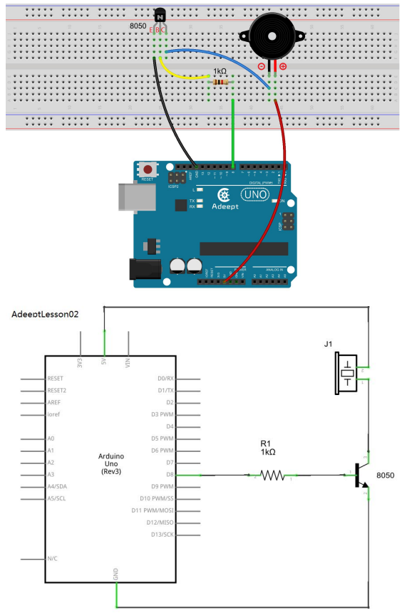

---

### 📸 Diagrama físico

Este es el montaje real en protoboard para comprobar la conexión correcta del zumbador.

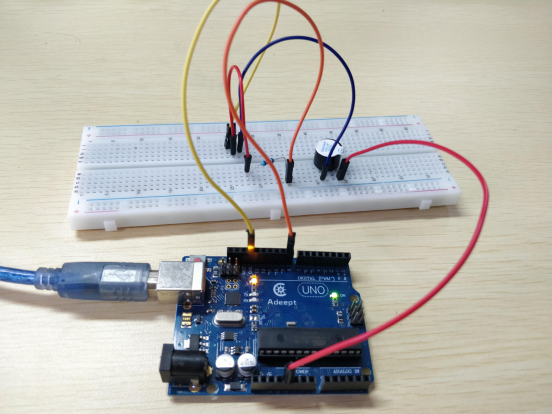

---

### 💡 Funcionamiento

Cuando el programa se ejecuta, el zumbador suena durante 2 segundos, se apaga durante 2 segundos, y repite este ciclo continuamente. Esto indica que el código y la conexión son correctos.

---

### 💻 Código base explicado

Este es el código en lenguaje C para Arduino UNO. Se define el pin del zumbador, se configura como salida, y se alterna su estado para generar sonido intermitente.

```cpp
// Declaración del pin donde está conectado el zumbador activo
int buzzerPin = 8;

void setup() {
  // Configurar el pin como salida
  pinMode(buzzerPin, OUTPUT);
}

void loop() {
  // Encender el zumbador (sonido)
  digitalWrite(buzzerPin, HIGH);
  // Esperar 2 segundos
  delay(2000);

  // Apagar el zumbador
  digitalWrite(buzzerPin, LOW);
  // Esperar 2 segundos
  delay(2000);
}

```
## 🔘 Lección 3: Controlar un LED con un Botón

### 📘 Descripción
En esta lección, aprenderemos cómo controlar un LED con un botón. Este experimento demuestra cómo leer entradas digitales (botones) para controlar salidas digitales (LEDs) usando Arduino.

---

### 🧰 Componentes utilizados
- 1x Arduino UNO  
- 1x LED  
- 1x Botón pulsador  
- 1x Resistencia de 220Ω (para el LED)  
- 1x Resistencia de 10kΩ (pull-down para el botón)  
- Cables de conexión  
- Protoboard  

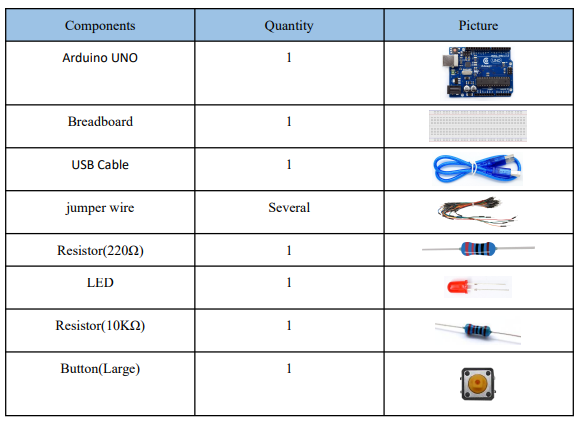

---

### 🔧 Diagrama de conexión (Circuit Diagram)

Antes de iniciar el experimento, conectamos los componentes en el circuito como se muestra en el siguiente esquema.  
⚠️ **Importante:** Presta atención a la polaridad del LED (ánodo y cátodo) y a la conexión correcta del botón.

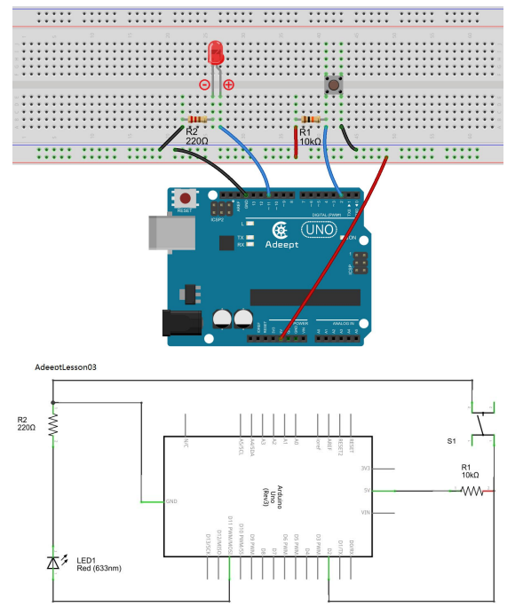

---

### 📸 Diagrama físico

Montaje del circuito en la protoboard. Observa la conexión entre el botón, la resistencia y el pin digital.

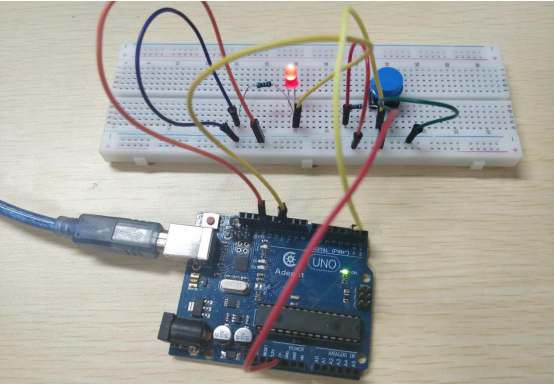

---

### 💻 Código base explicado

Este es el código en C para Arduino que permite encender el LED cuando el botón es presionado, y apagarlo al soltarlo.

```cpp
int ledpin = 11;   // Definición del pin digital 11 para el LED
int btnpin = 2;    // Definición del pin digital 2 para el botón

volatile int state = LOW; // Estado inicial del LED

void setup() {
  pinMode(ledpin, OUTPUT); // Configura el pin del LED como salida
  pinMode(btnpin, INPUT);  // Configura el pin del botón como entrada
}

void loop() {
  if (digitalRead(btnpin) == LOW) { // Si el botón está presionado
    digitalWrite(ledpin, 1);        // Enciende el LED
  }
  
  if (digitalRead(btnpin) != LOW) { // Si el botón no está presionado
    digitalWrite(ledpin, 0);        // Apaga el LED
  }
}

```
## ⚡ Lección 4: Controlar un LED con un Módulo de Relé

### 📘 Descripción
En esta lección aprenderemos cómo controlar un LED mediante un **módulo de relé**, el cual funciona como un interruptor controlado electrónicamente. Este experimento muestra cómo usar una salida digital para activar circuitos eléctricos más grandes usando Arduino.

---

### 🧰 Componentes utilizados
- 1x Arduino UNO  
- 1x Módulo de Relé (1 canal)  
- 1x LED  
- 1x Resistencia de 220Ω  
- Cables de conexión  
- Protoboard  

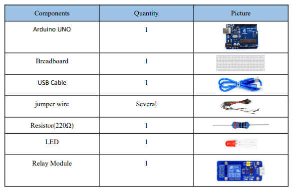

---

### 🔧 Diagrama de conexión (Circuit Diagram)

Conectamos el módulo de relé al pin digital 7 del Arduino y el LED a la salida controlada por el relé.  
⚠️ **Importante:** Verifica la polaridad del LED y asegúrate de que el relé esté bien alimentado.

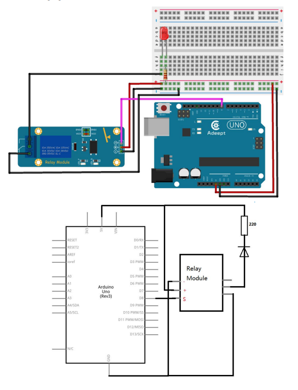

---

### 📸 Diagrama físico

Representación del montaje físico en la protoboard:  
- El pin IN del relé se conecta al pin 7 del Arduino.  
- El LED se conecta a través del relé con una resistencia de 220Ω.  

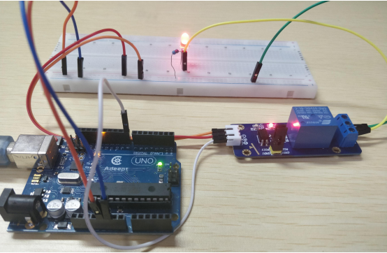

---

### 💻 Código base explicado

Este código activa el relé para encender un LED durante 1 segundo, luego lo apaga otro segundo, repitiéndose indefinidamente.

```cpp
int relayPin = 7; // Definición del pin digital 7 conectado al módulo de relé

void setup() {
  pinMode(relayPin, OUTPUT); // Configura el pin del relé como salida
}

void loop() {
  digitalWrite(relayPin, HIGH); // Activa el relé (LED encendido)
  delay(1000);                  // Espera 1 segundo

  digitalWrite(relayPin, LOW);  // Desactiva el relé (LED apagado)
  delay(1000);                  // Espera 1 segundo
}
```

## 🎚️ Lección 5: Controlar un LED con un Potenciómetro

### 📘 Descripción
En esta lección aprenderemos cómo **controlar un LED utilizando un potenciómetro**. Este experimento demuestra cómo podemos leer una entrada analógica y usar su valor para decidir si encender o apagar un LED.

---

### 🧰 Componentes utilizados
- 1x Arduino UNO  
- 1x LED  
- 1x Resistencia de 220Ω  
- 1x Potenciómetro  
- Cables de conexión  
- Protoboard  

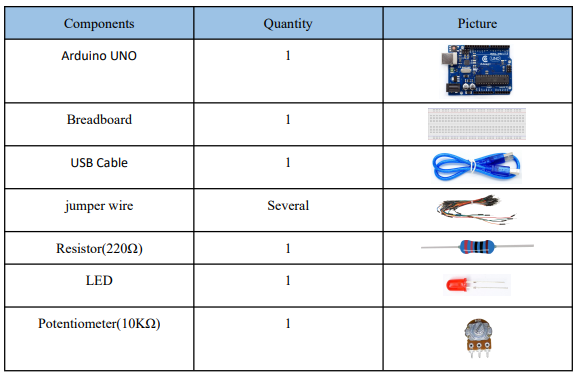

---

### 🔧 Diagrama de conexión (Circuit Diagram)

Conectamos el potenciómetro al pin analógico **A0** del Arduino, y el LED al pin digital **8**.  
⚠️ **Importante:** Asegúrate de conectar correctamente los extremos del potenciómetro y usar la resistencia de 220Ω con el LED para evitar quemarlo.

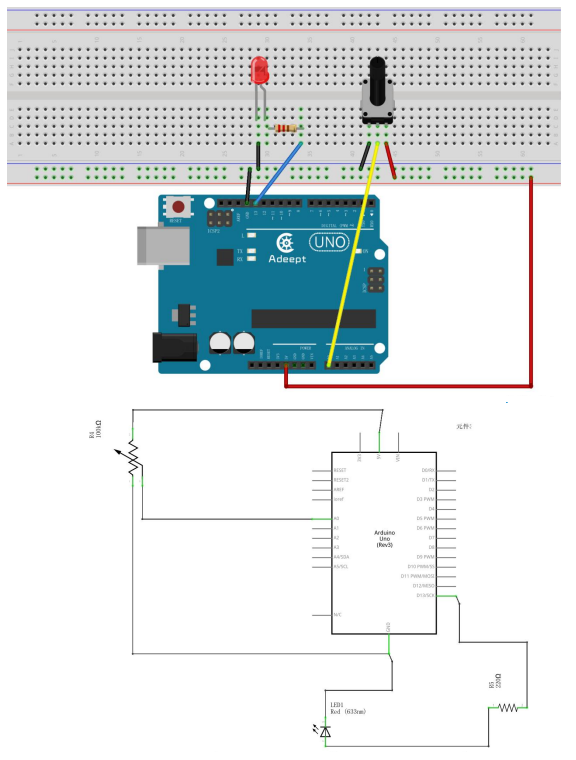

---

### 📸 Diagrama físico

Montaje físico en la protoboard:  
- El pin central del potenciómetro se conecta a **A0** del Arduino.  
- Uno de los extremos va a **5V** y el otro a **GND**.  
- El LED está conectado al pin digital **8** con una resistencia en serie.

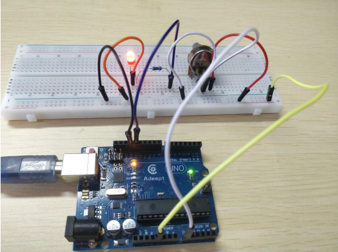

---

### 💻 Código base explicado

Este código lee el valor del potenciómetro y enciende el LED si ese valor es mayor a 500.

```cpp

int ledpin = 13;             // Definición del pin digital 13 para el LED
int potentiometer = 0;       // Pin A0 del potenciómetro

void setup() {
  pinMode(ledpin, OUTPUT);   // Configura el pin del LED como salida
}

void loop() {
  int a = analogRead(potentiometer); // Lee el valor del potenciómetro

  if (a > 500)
    digitalWrite(ledpin, HIGH);      // Enciende el LED
  else
    digitalWrite(ledpin, LOW);       // Apaga el LED
}
```

## 🌈 Lección 6: Crear un Efecto de LED Fluido (Flowing LED)

### 📘 Descripción
En esta lección aprenderemos cómo generar un efecto de **LED fluido** utilizando múltiples LEDs conectados a un Arduino. Este efecto se logra encendiendo y apagando LEDs en secuencia, simulando un movimiento visual.

---

### 🧰 Componentes utilizados
- 1x Arduino UNO  
- 8x LEDs  
- 8x Resistencias de 220Ω  
- Cables de conexión  
- Protoboard  

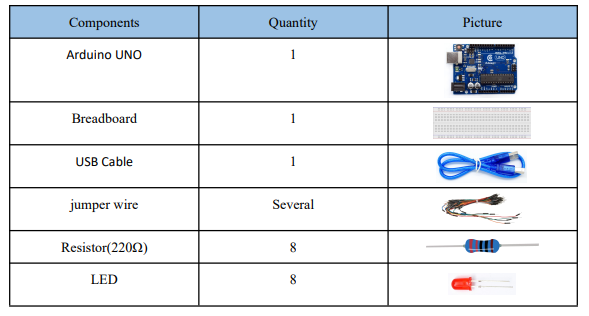

---

### 🔧 Diagrama de conexión (Circuit Diagram)

Conecta los LEDs a los pines digitales del 2 al 9, cada uno con su resistencia de 220Ω.  
⚠️ **Importante:** Verifica la polaridad de cada LED (ánodo y cátodo) antes de conectarlo.

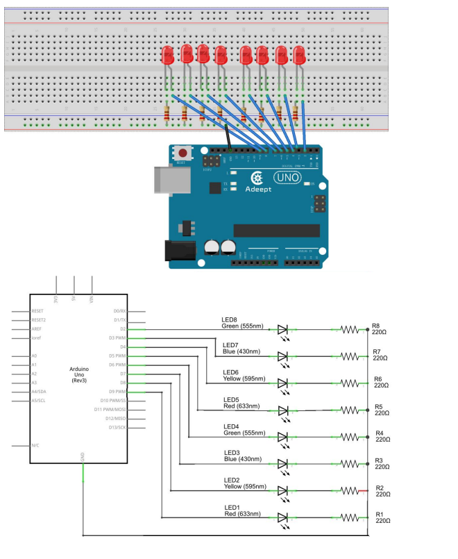

---

### 📸 Diagrama físico

Representación del montaje físico en la protoboard con los LEDs conectados del pin 2 al 9.

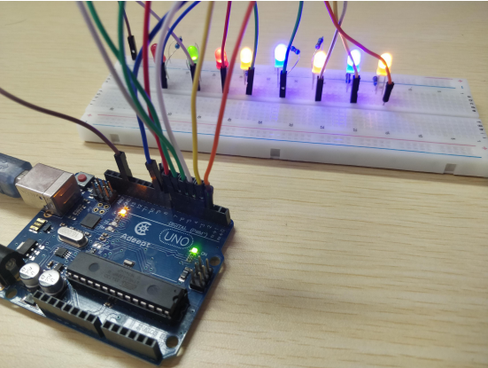

---

### 💻 Código base explicado

Este código enciende los LEDs desde el pin 2 al 9 uno por uno, luego en sentido inverso del 9 al 2, generando el efecto de LED fluido o "carrera".

```cpp
void setup()
{
  unsigned char ledPin;  // Variable para almacenar el número de pin

  for(ledPin = 2; ledPin <= 9; ledPin++) {
    pinMode(ledPin, OUTPUT); // Configura los pines del 2 al 9 como salidas
  }
}

void loop()
{
  unsigned char ledPin;

  // Efecto LED hacia adelante (2 → 9)
  for(ledPin = 2; ledPin <= 9; ledPin++) {
    digitalWrite(ledPin, HIGH); // Enciende el LED
    delay(300);
    digitalWrite(ledPin, LOW);  // Apaga el LED
  }

  // Efecto LED hacia atrás (9 → 2)
  for(ledPin = 9; ledPin >= 2; ledPin--) {
    digitalWrite(ledPin, HIGH); // Enciende el LED
    delay(300);
    digitalWrite(ledPin, LOW);  // Apaga el LED
  }
}
```
## 🎚️ Lección 7: Controlar una Barra de LEDs con un Potenciómetro

### 📘 Descripción
En esta lección aprenderemos cómo utilizar un **potenciómetro** para controlar cuántos LEDs se encienden en una **barra de LEDs**, dependiendo del valor leído del potenciómetro.

---

### 🧰 Componentes utilizados
- 1x Arduino UNO  
- 1x Potenciómetro  
- 10x LEDs (Barra LED o individuales)  
- 10x Resistencias de 220Ω  
- Cables de conexión  
- Protoboard  

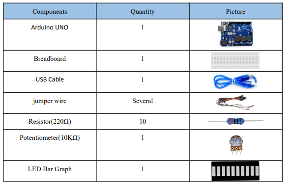

---

### 🔧 Diagrama de conexión

El potenciómetro está conectado al pin analógico A0 y cada LED a los pines digitales del 2 al 11.  
⚠️ **Nota:** Asegúrate de conectar una resistencia de 220Ω a cada LED.

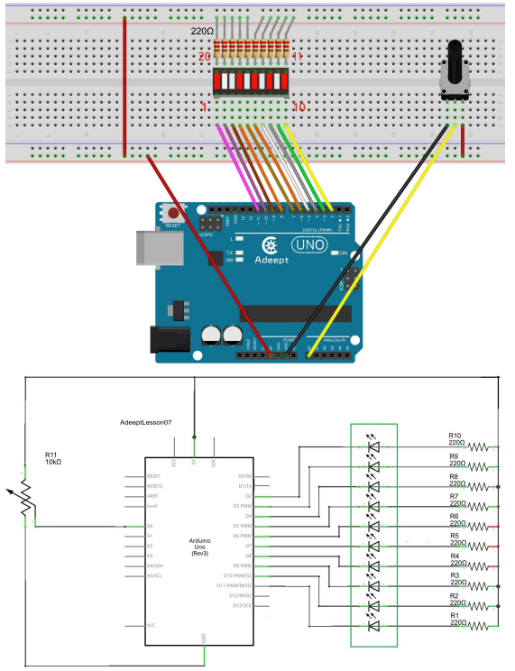

---
### 📸 Diagrama físico

A continuación se muestra cómo debe verse tu circuito ya armado físicamente:

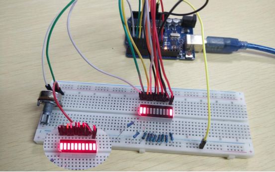

---
### 💻 Código base explicado

Este código lee el valor del potenciómetro y enciende una cantidad proporcional de LEDs en la barra.


```cpp
  void setup() {
    pinMode(pin1, OUTPUT);    // Configura el pin 1 como SALIDA (para LED)
    pinMode(pin2, OUTPUT);    // Configura el pin 2 como SALIDA
    pinMode(pin3, OUTPUT);    // Configura el pin 3 como SALIDA
    pinMode(pin4, OUTPUT);    // Configura el pin 4 como SALIDA
    pinMode(pin5, OUTPUT);    // Configura el pin 5 como SALIDA
    pinMode(pin6, OUTPUT);    // Configura el pin 6 como SALIDA
    pinMode(pin7, OUTPUT);    // Configura el pin 7 como SALIDA
    pinMode(pin8, OUTPUT);    // Configura el pin 8 como SALIDA
    pinMode(pin9, OUTPUT);    // Configura el pin 9 como SALIDA
    pinMode(pin10, OUTPUT);   // Configura el pin 10 como SALIDA
}

void loop() {
    float a = analogRead(potentiometerPin);  // Lee el valor del potenciómetro (0-1023)
    a = map(a, 0, 1023, 0, 11);             // Escala el valor a un rango de 0-11

    // Apaga los LEDs desde el pin 1 hasta el valor mapeado (a)
    for(int i = 1; i <= a; i++) {
        digitalWrite(i, LOW);  // LOW = 0V (LED apagado)
    }

    // Enciende los LEDs desde el pin 10 hacia abajo hasta el valor mapeado (a)
    for(int j = 10; j >= a; j--) {
        digitalWrite(j, HIGH);  // HIGH = +5V (LED encendido)
    }

    delay(50);  // Pequeña pausa para evitar parpadeos
}

```
Versión Mejorada con Arreglo (Array) para Controlar la Barra LED
```cpp
int sensorPin = A0; // Pin analógico donde está conectado el potenciómetro
int ledCount = 10;  // Número total de LEDs
int ledPins[] = {2, 3, 4, 5, 6, 7, 8, 9, 10, 11}; // Pines conectados a cada LED

void setup() {
  for (int i = 0; i < ledCount; i++) {
    pinMode(ledPins[i], OUTPUT); // Configura cada pin de LED como salida
  }
}

void loop() {
  int sensorValue = analogRead(sensorPin); // Lee el valor del potenciómetro (0-1023)
  int ledLevel = map(sensorValue, 0, 1023, 0, ledCount); // Mapea el valor a 0-10 LEDs

  // Apaga todos los LEDs primero
  for (int i = 0; i < ledCount; i++) {
    digitalWrite(ledPins[i], LOW);
  }

  // Enciende los LEDs según el valor del potenciómetro
  for (int j = 0; j < ledLevel; j++) {
    digitalWrite(ledPins[j], HIGH);
  }

  delay(100); // Pequeña pausa para estabilidad visual
}

```
## 🌬️ Lección 8: Hacer un LED Respirante (Breathing LED)

### 📘 Descripción
En esta lección aprenderemos cómo hacer un efecto de "respiración" con un LED, es decir, que su brillo aumente y disminuya suavemente utilizando **PWM (modulación por ancho de pulso)** en Arduino.

---

### 🧰 Componentes utilizados
- 1x Arduino UNO  
- 1x LED  
- 1x Resistencia de 220Ω  
- Cables de conexión  
- Protoboard  

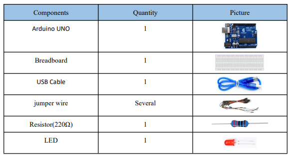

---

### 🔧 Diagrama de conexión (Circuit Diagram)

- El pin digital **11** del Arduino se conecta a través de una **resistencia de 220Ω** al ánodo del LED.
- El cátodo del LED va a **GND**.
- ⚠️ **Importante:** PWM solo funciona en pines compatibles (como el 11 en Arduino UNO).

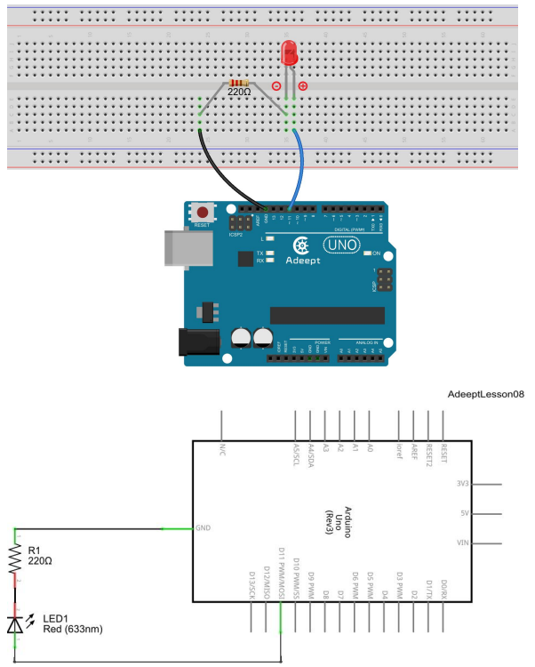

---

### 📸 Diagrama físico

Representación del montaje físico en la protoboard:

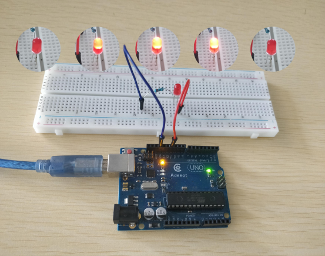

---

### 💻 Código base explicado

Este código genera un efecto de respiración, variando el brillo del LED usando `analogWrite()` con PWM.

```cpp
int ledpin = 11; // Pin del LED con PWM

void setup() {
  pinMode(ledpin, OUTPUT); // Configura el pin como salida
}

void loop() {
    // Fase 1: Aumento gradual de brillo (fade-in)
    for (int a = 0; a <= 65; a++) {  // Bucle de 0 a 65
        analogWrite(ledpin, a);       // Establece el brillo PWM (0-65)
        
        if (a < 20) {
            delay(70);  // Retardo más largo para valores bajos de PWM
        } else {
            delay(10);  // Retardo más corto para valores altos
        }
    }

    // Fase 2: Disminución gradual de brillo (fade-out)
    for (int a = 65; a >= 0; a--) {  // Bucle de 65 a 0
        analogWrite(ledpin, a);       // Establece el brillo PWM (65-0)
        
        if (a < 20) {
            delay(70);  // Retardo más largo para valores bajos
        }
        delay(10);      // Retardo adicional (¡error de lógica aquí!)
    }

    delay(200);  // Pausa final de 200ms entre ciclos
}