---  
title: 📗Sesión 2- Displays, Sensores y Actuadores Simples
description: Curso avanzado de Arduino dividido edss  
---
---

## 📗 Sesión 2: Displays, Sensores y Actuadores Simples

12. Aplicación del LED RGB  
13. Aplicación del zumbador pasivo  
14. Aplicación del LCD1602 con interfaz IIC  
15. Crear un voltímetro  
16. Aplicación del display de 7 segmentos  
17. Crear un contador simple  
18. Controlar el servomotor  
19. Crear un termómetro digital  


## 🌈 Lección 9: Uso de un LED RGB

### 📘 Descripción
En esta lección aprenderemos a controlar un **LED RGB de ánodo común** usando un Arduino UNO. Este tipo de LED combina tres LEDs (rojo, verde y azul) en un solo encapsulado. Al variar la intensidad de cada color mediante **PWM**, podemos generar una amplia gama de colores como amarillo, púrpura o blanco.

---

### 🧰 Componentes utilizados
- 1x Arduino UNO  
- 1x LED RGB de ánodo común  
- 3x Resistencias de 220Ω  
- Cables de conexión  
- Protoboard  

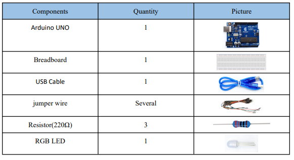

---

### 🌟 ¿Qué es un LED RGB y cómo funciona?

Un **LED RGB** (Red-Green-Blue) es un diodo que contiene en su interior **tres LEDs** individuales (uno rojo, uno verde y uno azul) encapsulados juntos. Tiene **cuatro pines**: uno común (ánodo o cátodo) y tres pines de control, uno para cada color.

🔌 En este experimento utilizaremos un **LED RGB de ánodo común**, donde:
- El **pin más largo** (ánodo común) se conecta a **5V**.
- Los otros tres pines se conectan a los pines **9**, **10** y **11** del **Arduino UNO**, cada uno con una **resistencia limitadora de 220Ω**.

💡 Al variar la intensidad de los colores mediante **PWM (modulación por ancho de pulso)**, podemos mezclar colores y obtener una amplia gama visual, incluyendo amarillo, cian, púrpura, blanco, entre otros.
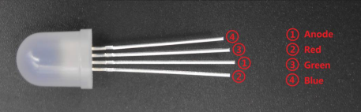

---


### 🔧 Diagrama de conexión (Circuit Diagram)

- El pin **más largo** del LED RGB es el **ánodo común**, y se conecta al pin de **5V** del Arduino.
- Los otros tres pines (rojo, verde y azul) se conectan a los pines **11, 10 y 9** del Arduino respectivamente, cada uno con una **resistencia de 220Ω**.
- ⚠️ **Importante:** Asegúrate de conectar correctamente cada color al pin correspondiente.

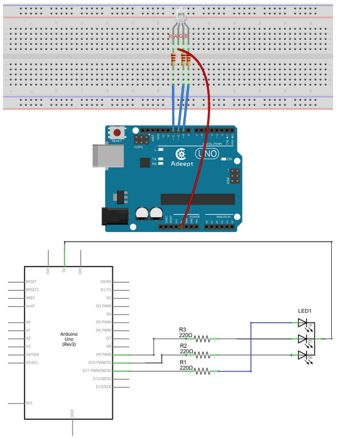

---

### 📸 Diagrama físico

Representación del montaje físico en la protoboard:

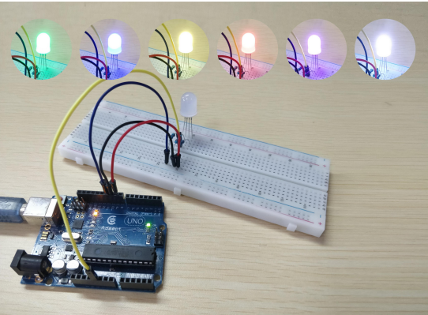

---

### 💻 Código base explicado

Este programa enciende el LED RGB mostrando distintos colores (rojo, verde, azul, amarillo, púrpura y blanco) usando PWM.

```cpp
// Definición de pines
int redPin = 11;
int greenPin = 10;
int bluePin = 9;

void setup() {
  // Configuramos los pines como salida
  pinMode(redPin, OUTPUT);
  pinMode(greenPin, OUTPUT);
  pinMode(bluePin, OUTPUT);
}

void loop() {
  // Mostrar varios colores en secuencia
  color(255, 0, 0);   // Rojo
  delay(1000);
  color(0, 255, 0);   // Verde
  delay(1000);
  color(0, 0, 255);   // Azul
  delay(1000);
  color(255, 255, 0); // Amarillo
  delay(1000);
  color(255, 255, 255); // Blanco
  delay(1000);
  color(255, 0, 255); // Púrpura
  delay(1000);
}

// Función para establecer el color
void color(int red, int green, int blue) {
  analogWrite(redPin, 255 - red);
  analogWrite(greenPin, 255 - green);
  analogWrite(bluePin, 255 - blue);
}

```

## 🔊 Lección 10: Aplicación del Buzzer Pasivo

### 📘 Descripción

En esta lección aprenderemos a controlar un **buzzer pasivo** utilizando Arduino UNO. Este componente permite generar sonidos o alarmas mediante una señal PWM.

---
### 🧰 Componentes utilizados

- 1x Arduino UNO  
- 1x Buzzer pasivo  
- 1x Resistencia de 220Ω  
- 1x Transistor NPN (S8050)  
- Cables de conexión  
- Protoboard  
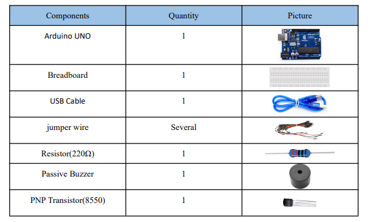

---

### 🎵 ¿Qué es un buzzer pasivo?

Un **buzzer** es un dispositivo electrónico que emite sonidos al recibir corriente eléctrica. Existen dos tipos:

- **🔋 Activo:** emite un tono por sí mismo al recibir corriente.
- **🔌 Pasivo:** requiere una señal alterna (como PWM) para generar distintos tonos.

📌 En esta práctica trabajaremos con el **buzzer pasivo**, el cual tiene **dos pines del mismo tamaño**. Se controla con una señal generada desde el Arduino, permitiendo modular la frecuencia y duración del sonido.


### ⚙️ Tipos de transistores: S8050 y S8550

Para hacer sonar un **buzzer activo**, se requiere una **corriente mayor** que la que puede entregar directamente un GPIO del microcontrolador (como el de una Raspberry Pi o Arduino). Por ello, se utiliza un **transistor** como **amplificador de corriente**.

#### 📌 ¿Por qué usar transistores?

- La salida del pin GPIO no es suficiente para alimentar directamente un buzzer activo.
- Los transistores permiten **controlar corrientes altas** con una señal débil desde el GPIO.
- Actúan como **interruptores electrónicos**.

#### 🔧 Tipos de transistores usados

- **S8050:** tipo NPN (conduce cuando la base recibe voltaje positivo)
- **S8550:** tipo PNP (conduce cuando la base recibe voltaje negativo)

Ambos tienen la **misma disposición de pines**:  
**E = Emisor**, **B = Base**, **C = Colector**

---

### 🖼️ Imagen del transistor y su pinout

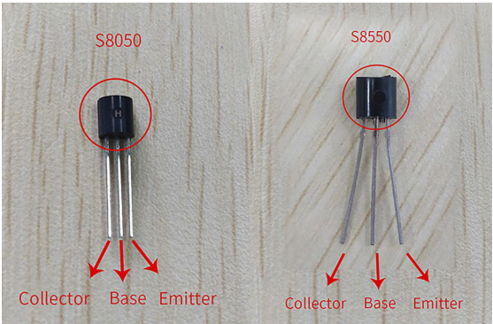

> 🧠 Nota: En esta práctica usamos el **S8050 (NPN)**, ya que es más común para controlar cargas conectadas a GND como los buzzers pasivos.

---


### 📊 Diagrama de conexión

Usamos un transistor **S8050 (NPN)** para amplificar la señal, ya que el buzzer requiere más corriente de la que puede entregar directamente el pin del Arduino.

📌 Conexiones:

- **Base del transistor (b)** → Pin 8 del Arduino (con resistencia de 220Ω)
- **Emisor (e)** → GND
- **Colector (c)** → pin negativo del buzzer
- **Pin positivo del buzzer** → 5V

📷 **Figura referencial del transistor y buzzer:**
- S8050: Base (B), Colector (C), Emisor (E)
- Buzzer pasivo: pines del mismo tamaño
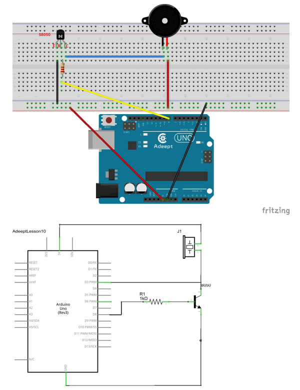
---

### 📸 Diagrama físico

Representación del montaje en protoboard:

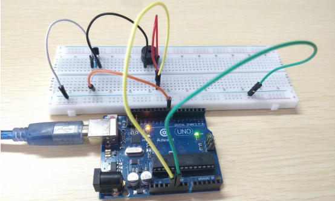

---

### 💻 Código base explicado

Este código hace sonar el buzzer a una frecuencia determinada por un tiempo y luego lo apaga.

```cpp
int tonepin = 8;         // Pin donde conectamos la base del transistor
int MUSIC = 500;         // Frecuencia del tono en Hz

void setup() {
  pinMode(tonepin, OUTPUT);    // Configuramos el pin como salida
}

void loop() {
  tone(tonepin, MUSIC);   // Emite sonido a 500Hz
  delay(1000);            // Espera 1 segundo
  noTone(tonepin);        // Detiene el sonido
  delay(1000);            // Espera 1 segundo antes de repetir
}
```
## 📺 Lección 11: Aplicación del LCD1602 con Interfaz IIC

### 📘 Descripción

En esta lección aprenderemos a utilizar una **pantalla LCD1602** junto con un **adaptador IIC (I2C)** para reducir el número de pines usados en el Arduino UNO. Esta pantalla permite mostrar mensajes en dos líneas de 16 caracteres cada una.

---

### 🧰 Componentes utilizados

- 1x Arduino UNO  
- 1x Pantalla LCD1602  
- 1x Módulo adaptador IIC/I2C  
- 1x Potenciómetro (opcional para brillo)  
- Cables de conexión  
- Protoboard  
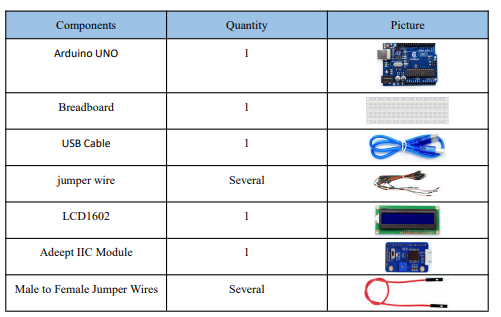

---

### 🔍 ¿Qué es el LCD1602?

El **LCD1602** es una pantalla de cristal líquido que permite mostrar **texto en dos líneas de 16 caracteres**. Internamente incluye el chip **HD44780**, el cual permite el control del texto mostrado.

Se compone de:

- La pantalla LCD como tal  
- Un circuito de control  
- Resistencias, condensadores y otros componentes ya montados en un PCB  

📌 Es ideal para mostrar datos como temperatura, mensajes o estado del sistema.

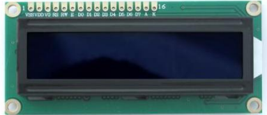
---

### 🔌 ¿Qué es la interfaz IIC?

**IIC (o I2C)** significa *Inter-Integrated Circuit*. Es un protocolo de comunicación en serie que permite que varios dispositivos se comuniquen con solo dos líneas:

- **SDA:** Datos  
- **SCL:** Reloj  

✅ Ventajas del IIC:

- Solo requiere 2 pines del Arduino  
- Permite conectar múltiples dispositivos en el mismo bus  
- Simplifica el cableado  
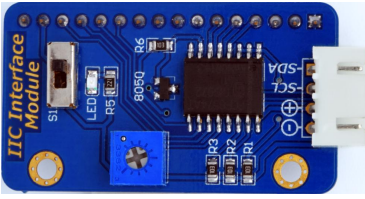
---

### 📊 Diagrama de conexión

Conexiones usando la interfaz IIC:

| Pin LCD IIC | Pin Arduino UNO |
|-------------|------------------|
| VCC         | 5V               |
| GND         | GND              |
| SDA         | A4               |
| SCL         | A5               |

📷 Diagrama referencial:  
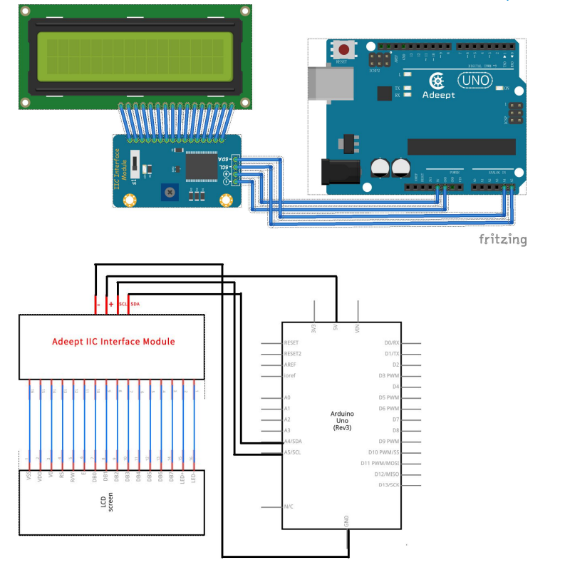

---


### 📸 Diagrama físico

Representación del montaje en protoboard:

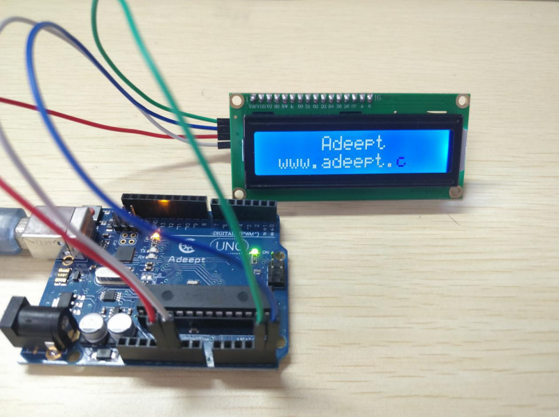


### 💻 Código base explicado

Este programa inicializa la pantalla LCD1602 y muestra un mensaje personalizado.

```cpp
// Definición de arrays de caracteres (cadenas) que se mostrarán en la LCD
char array1[] = "    Adeept    ";    // Cadena para mostrar en la LCD
char array2[] = "  hello geeks!    ";  // Cadena para mostrar en la LCD
char array3[] = " www.adeept.com ";    // Cadena para mostrar en la LCD

int tim = 250;  // Valor del tiempo de retardo en milisegundos

// Inicialización de la biblioteca LCD con los números de los pines de interfaz
// Dirección I2C 0x27, 16 columnas y 2 filas
LiquidCrystal_IQC lcd(0x27, 16, 2);

void setup()
{
    lcd.init(); // Inicializa la LCD
    lcd.backlight(); // Enciende la retroiluminación
}

void loop()
{
    lcd.clear(); // Limpia la pantalla LCD y coloca el cursor en la esquina superior izquierda
    
    // Primer efecto: desplazamiento de texto desde la derecha
    lcd.setCursor(15, 0);    // Coloca el cursor en la columna 15, línea 1 (nota: parece haber un error, debería ser línea 0)
    for (int positionCounter1 = 0; positionCounter1 < 30; positionCounter1++)
    {
        lcd.scrollDisplayLeft(); // Desplaza el contenido de la pantalla un espacio a la izquierda
        lcd.print(array1[positionCounter1]); // Imprime un carácter del array1 en la LCD
        delay(tim);    // Espera 250 milisegundos
    }
    
    lcd.clear(); // Limpia la pantalla LCD nuevamente
    
    // Segundo efecto: impresión progresiva en la primera línea
    lcd.setCursor(0, 0);    // Coloca el cursor en la columna 0, línea 0
    for (int positionCounter1 = 0; positionCounter1 < 10; positionCounter1++)
    {
        lcd.print(array2[positionCounter1]); // Imprime un carácter del array2 en la LCD
        delay(tim);    // Espera 250 milisegundos
    }
    
    // Tercer efecto: impresión progresiva en la segunda línea
    lcd.setCursor(0, 1);    // Coloca el cursor en la columna 0, línea 1
    for (int positionCounter3 = 0; positionCounter3 < 10; positionCounter3++)
    {
        lcd.print(array3[positionCounter3]); // Imprime un carácter del array3 en la LCD
        delay(tim);    // Espera 250 milisegundos
    }
}