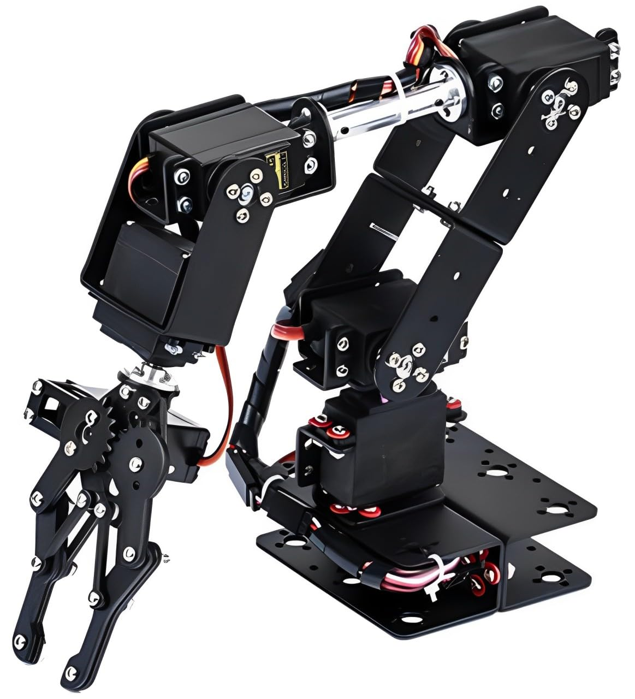

Los brazos robóticos son dispositivos mecánicos diseñados para imitar la funcionalidad de un brazo humano. Se utilizan en diversas aplicaciones, desde la automatización industrial hasta la educación y la robótica de servicio.  

Comprender qué es un brazo robótico y cómo funciona es fundamental antes de comenzar a ensamblarlo y programarlo.

## Conceptos clave

- **Grados de libertad (DOF):** Indican el número de movimientos independientes del brazo.
- **Servomotores:** Motores que permiten el control preciso de la posición y el movimiento.
- **Controlador de servos:** Un módulo que gestiona la alimentación y la señal de los servomotores.
- **Alimentación eléctrica:** Fuente de energía necesaria para operar los motores y la electrónica.

## Aplicaciones y usos

Los brazos robóticos tienen aplicaciones en:
- **Industria:** Ensamblaje, soldadura, manipulación de materiales.
- **Educación:** Aprendizaje de programación y control de sistemas robóticos.
- **Medicina:** Cirugía asistida por robots.
- **Exploración:** Uso en ambientes hostiles o inaccesibles para los humanos.

## Lecturas adicionales

- Aprende más sobre [la robótica y sus aplicaciones](https://example.com).
- Consulta la documentación sobre [Arduino y controladores de servos](https://example.com).
