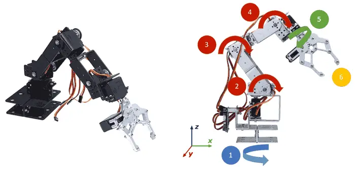
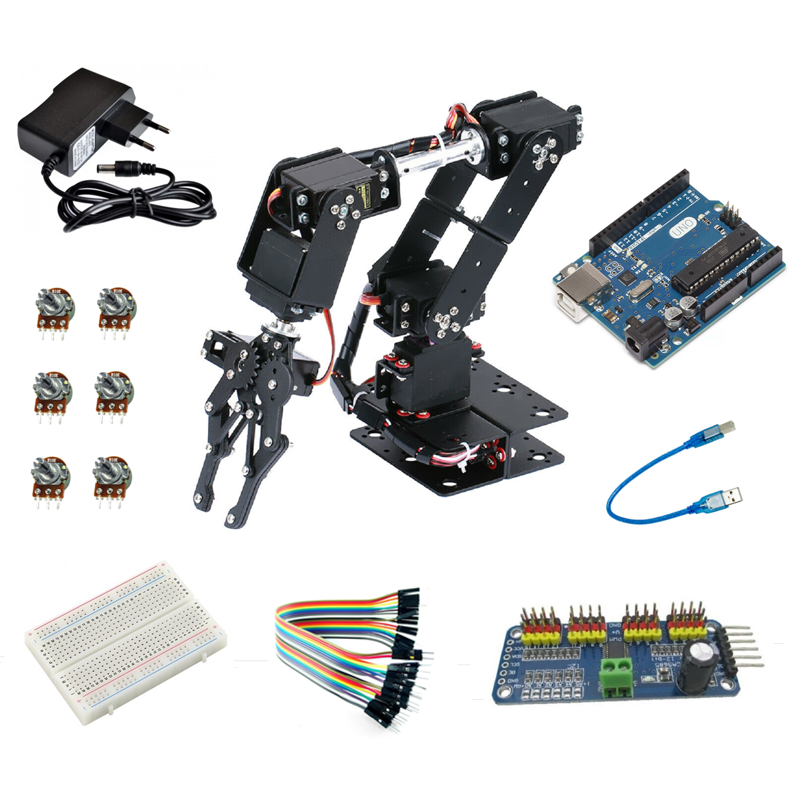

La **estructura del brazo robótico** está compuesta por varios segmentos unidos mediante servomotores, permitiendo movimientos precisos en múltiples direcciones.

---



## 🔹 Componentes Principales



1. **Base** 🏗️  
   - Sujeta el brazo y permite su rotación.  
   - Controlado por un **servo base**.  

2. **Eslabones** 🔩  
   - Conectan las articulaciones del brazo.  
   - Cada eslabón está controlado por un **servo**.  

3. **Pinza o Efector Final** 🤖✋  
   - Se usa para sujetar objetos.  
   - Controlado por un **servo de agarre**.  

4. **Controlador de Servos (PCA9685)** ⚙️  
   - Permite controlar **hasta 16 servos** con solo dos pines I2C.  
   - Se comunica con **Arduino** mediante la librería `Adafruit_PWMServoDriver`.  

---

## 🔹 Conexión del Controlador de Servos

| Controlador PCA9685 | Arduino |
|----------------------|---------|
| VCC                 | 5V      |
| GND                 | GND     |
| SDA                 | A4      |
| SCL                 | A5      |

Los **servomotores** se conectan a los pines **PWM** del controlador.

---

## 🔹 Código para Controlar el Brazo

Este código usa la **librería de Adafruit** para manejar el controlador de servos.

```cpp
#include <Wire.h>
#include <Adafruit_PWMServoDriver.h>

#define MIN_PULSE 150   // Pulso mínimo del servo
#define MAX_PULSE 600   // Pulso máximo del servo

Adafruit_PWMServoDriver servos = Adafruit_PWMServoDriver(0x40);

void setup() {
  Serial.begin(9600);
  servos.begin();
  servos.setPWMFreq(50);  // Frecuencia de 50Hz para servos
}

void moverServo(int numServo, int angulo) {
  int pulso = map(angulo, 0, 180, MIN_PULSE, MAX_PULSE);
  servos.setPWM(numServo, 0, pulso);
}

void loop() {
  moverServo(0, 90);  // Base a 90 grados
  moverServo(1, 45);  // Hombro a 45 grados
  moverServo(2, 90);  // Codo a 90 grados
  moverServo(3, 45);  // Muñeca rotación
  moverServo(4, 90);  // Muñeca inclinación
  moverServo(5, 20);  // Pinza abierta
  delay(1000);

  moverServo(0, 180);
  moverServo(1, 90);
  moverServo(2, 45);
  moverServo(3, 90);
  moverServo(4, 45);
  moverServo(5, 70);  // Pinza cerrada
  delay(1000);
}
