import { LinkButton } from '@astrojs/starlight/components';
import { Badge } from '@astrojs/starlight/components';
import { CardGrid } from '@astrojs/starlight/components';
import { Aside } from '@astrojs/starlight/components';
import { LinkCard } from '@astrojs/starlight/components';
import { Card } from '@astrojs/starlight/components';
import { Tabs, TabItem } from '@astrojs/starlight/components';

---

# Máquina Láser CO2 <Badge text="90x60cm" color="pink"></Badge> <Badge text="80W–100W" color="blue"></Badge>

Máquina láser compacta para **corte y grabado en no metales** con un área de trabajo de **90×60 cm**, diseñada para **alta precisión y gran velocidad**.  
Incluye **instalación y capacitación presencial en todo el Perú**.  

---

## 📸 Vista General
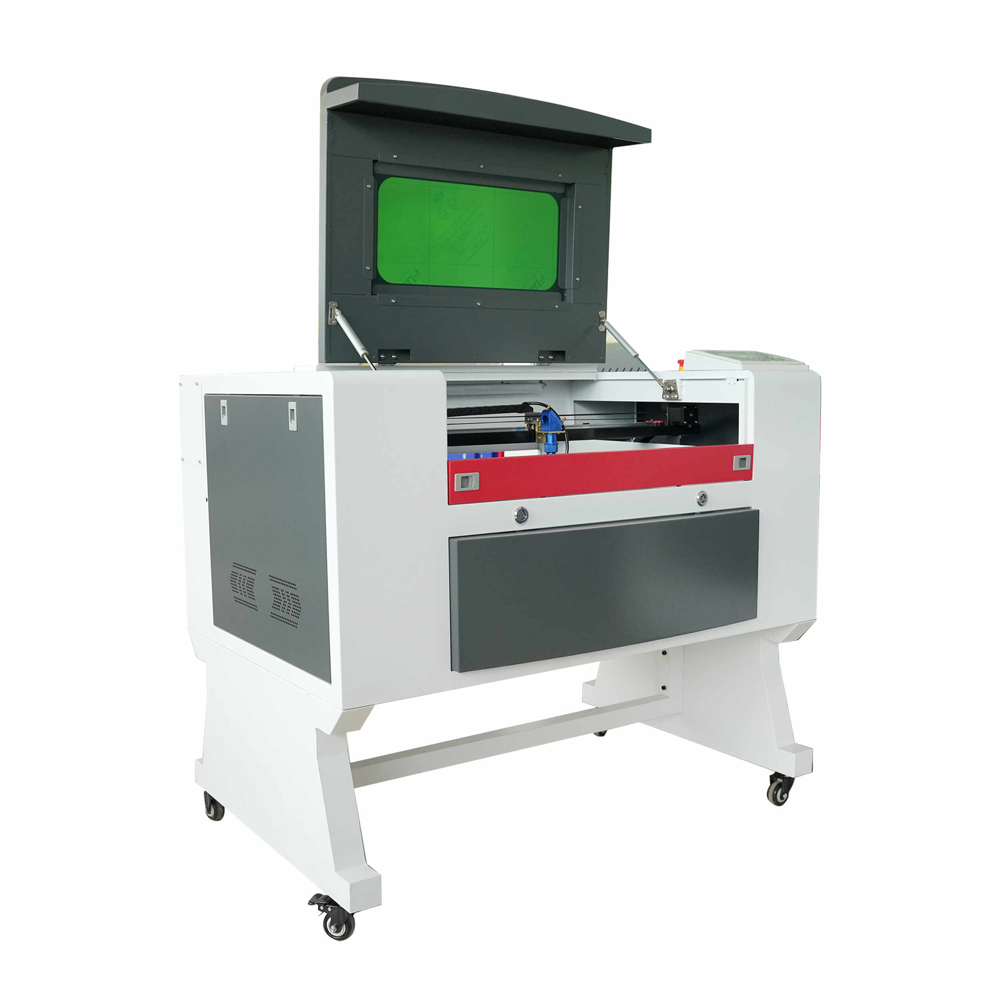

<Aside type="tip">
💡 Perfecta para **talleres de publicidad, diseño, emprendimientos y producción industrial ligera**.
</Aside>

---

## 📊 Ficha Técnica

<Tabs>
  <TabItem label="Características Principales">

| Especificación       | Detalle |
|----------------------|---------|
| **Área de trabajo**  | 90x60 cm |
| **Mesa de trabajo**  | Panal de abeja |
| **Plataforma**       | Sube y baja motorizado |
| **Tubo láser**       | RECI 80W–100W (corte hasta 12mm, duración 10,000 h) |
| **Software**         | RdWorks |
| **Compatibilidad**   | Windows XP/7/8/10 |
| **Panel de control** | Ruida RDC7132G |

  </TabItem>
  <TabItem label="Rendimiento">

| Especificación       | Detalle |
|----------------------|---------|
| **Velocidad corte**  | 0–2000 mm/s |
| **Velocidad grabado**| 0–4000 mm/s |
| **Motores de paso**  | 57 (x3) |
| **Lente**            | 20mm diámetro, focal 60.3 mm |
| **Fuente de poder**  | CO2 80W–100W |
| **Formatos soportados** | BMP, HPGL, PLT, DXF, AI |

  </TabItem>
  <TabItem label="Energía y Dimensiones">

| Especificación       | Detalle |
|----------------------|---------|
| **Voltaje**          | 220V ±10%, 50–60 Hz (monofásico) |
| **Refrigeración**    | Chiller 3000 (3L agua destilada, alarma de protección) |
| **Dimensiones**      | 150×95×80 cm |
| **Peso**             | 180 kg |
| **Embalaje**         | Caja de madera contrachapada |

  </TabItem>
</Tabs>

---

## 🎁 Accesorios Incluidos

<CardGrid>
  <Card title="Tubo Láser CO2 RECI">
    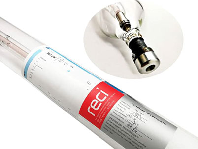  
    Descarga a alta presión concentrando CO2 para generar el láser.  
    - Temp: 2–40 ℃  
    - Humedad: 10–60%
  </Card>

  <Card title="Cabezal de Alta Precisión">
    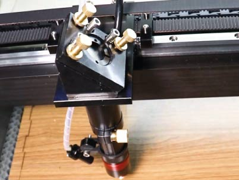  
    Guía el rayo láser y sostiene el lente para estabilidad del haz.
  </Card>

  <Card title="Panel de Control Ruida">
    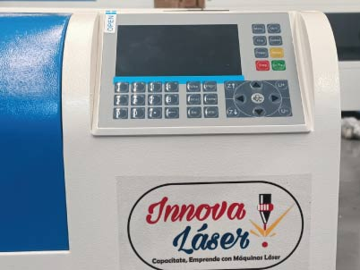  
    Pantalla digital Ruida 6445G con control total de potencia y archivos.
  </Card>

  <Card title="Chiller 3000 (Enfriador)">
    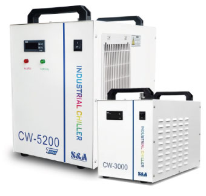  
    Capacidad: **7L de agua destilada**, con alarma de protección.
  </Card>

  <Card title="Compresor de Aire">
    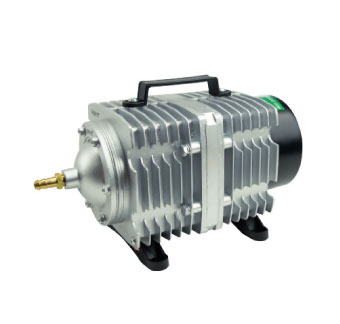  
    Flujo de aire que expulsa humo y mantiene el lente limpio.
  </Card>

  <Card title="Extractor de Humo">
    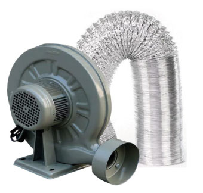  
    Potencia de **550W**. Voltaje: 220V.
  </Card>

  <Card title="Plataforma Sube y Baja">
    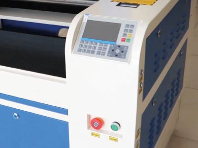  
    Ajuste de la mesa con solo dos botones.
  </Card>

  <Card title="Mesa tipo Panal de Abeja">
    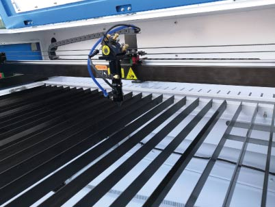  
    Acero galvanizado + cuchillas de aluminio.
  </Card>

  <Card title="Motores de Paso">
    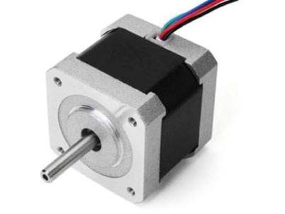  
    03 motores de alta precisión para cortes perfectos.
  </Card>

  <Card title="Fuente de Poder">
    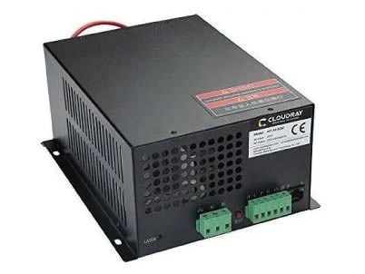  
    CO2 80W–100W, con arranque bajo y alta frecuencia de respuesta.
  </Card>

  <Card title="Lente y Espejos">
    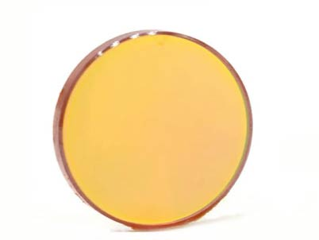  
    - **Lente:** 20mm, focal 60.3 mm  
    - **Espejos:** 25mm, Molibdeno (x3)
  </Card>

  <Card title="Herramientas y Accesorios">
    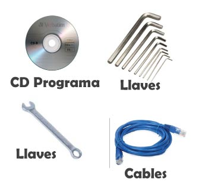  
    Incluye llaves, cables, adaptadores y kit de mantenimiento.
  </Card>

  <Card title="Dispositivo Giratorio (Gratis)">
    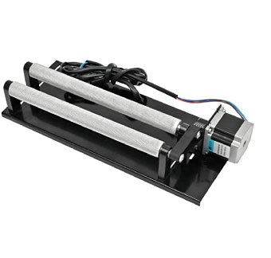  
    Ideal para grabar botellas, copas y termos.
  </Card>
</CardGrid>

---

## 🧾 Materiales Compatibles

<Aside type="caution">
⚠️ No se recomienda cortar **metales**. Solo es posible el grabado en acero inoxidable.
</Aside>

| Tipo de Material | Operación |
|------------------|-----------|
| **Madera, MDF, Triplay** | Corte, grabado, marcado |
| **Cartón, Cartulina, Vinil, Foamy** | Corte, grabado, marcado |
| **Cuero natural y sintético, telas** | Corte, grabado, marcado |
| **Acrílico, plástico, stencil** | Corte, grabado, marcado |
| **Vidrio, acero inoxidable** | Grabado |
| **Mármol, piedra, cemento** | Grabado |

Ejemplos:  
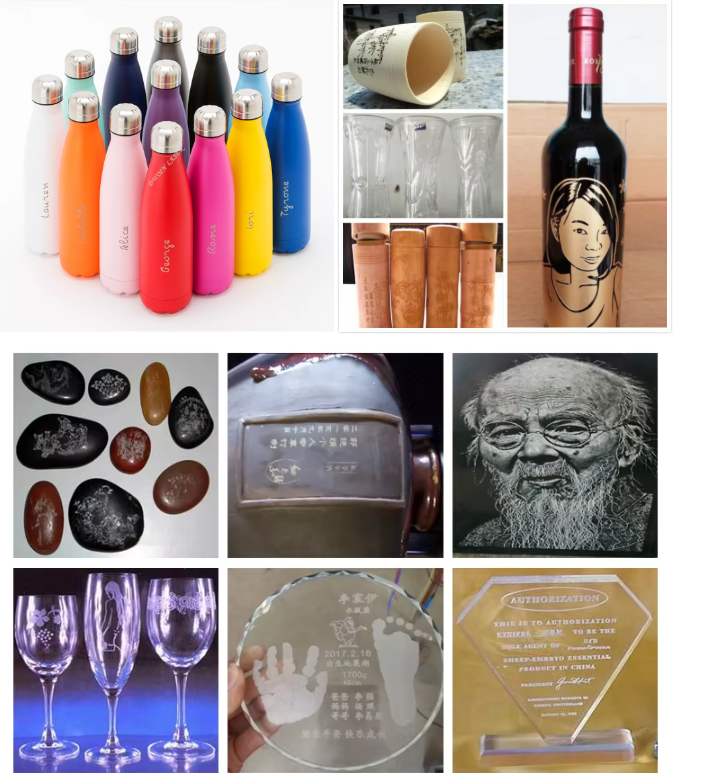  
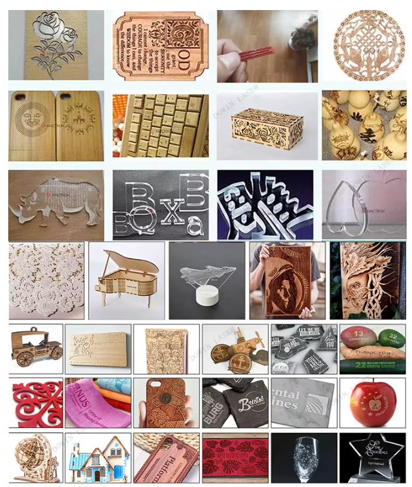  

---

<LinkCard title="📥 Descargar Software RDWorks" href="https://megalaser.com.ar/descargas/" />

