## 1. Introducción 
### ¿Qué es una impresora 3D?
- Dispositivo que fabrica objetos tridimensionales mediante la adición de material capa por capa.

 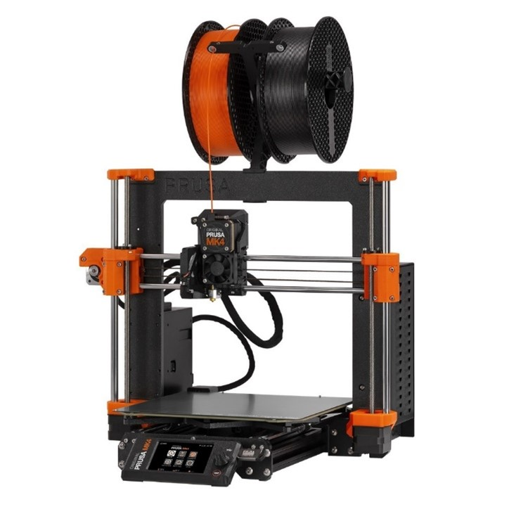  

### ¿Por qué la Prusa?
- Reconocida por su calidad, precisión y versatilidad.
- Ideal para educación, investigación y uso profesional.

## 2. Componentes Clave de la Prusa
- **Partes principales:**
  - Estructura robusta.
  - Extrusor y boquilla.
  - Plataforma de impresión con calentamiento (heatbed).
  - Motores paso a paso.
  - Fuente de alimentación.
  - Pantalla y controladores.

## 3. Especificaciones Técnicas
- **Modelos comunes:** Prusa i3 MK3S+ o Mini+.
- **Tamaño de impresión:** Hasta 250 x 210 x 200 mm (según el modelo).
- **Resolución:** Hasta 50 micrones.
- **Materiales compatibles:**
  - PLA, ABS, PETG, TPU, Nylon, etc.
- **Velocidad de impresión:** 40-200 mm/s.

## 4. Proceso de Impresión
### 1. Diseño del modelo
- Usar software CAD como Fusion 360, TinkerCAD o Blender.

 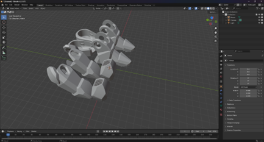  

- Se recomienda exportar los objetos en formato `.stl`, aunque pueden usarse otras extensiones.

### 2. Generación del G-code
- Utilizar software de laminado como **PrusaSlicer**. [Descargar aqui](https://www.prusa3d.com/es/pagina/prusaslicer_424/)  


- Importar el modelo en PrusaSlicer:
  ```
  Archivo -> Importar -> Importar STL/3MF/STEP/OBJ/…
  ```

   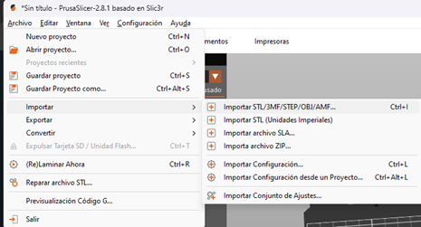  
   
- Previsualizar el modelo para verificar si necesita soportes o cambios de posición.

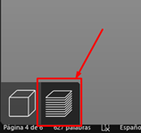  
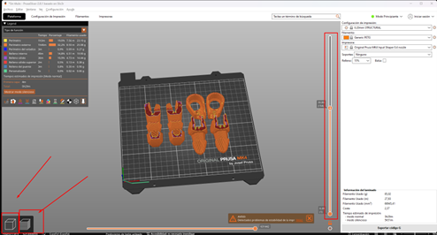  

### 3. Impresión
- Exportar el archivo en formato `.gcode` a un USB para la impresora.
  ```
  Archivo -> Exportar -> Código G-code
  ```
  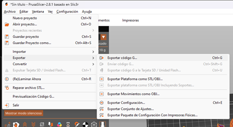  
- Asegurarse de que la impresora esté encendida y lista para operar.
- En el menú de la pantalla táctil, seleccionar **Cargar filamento**.
- Esperar a que el cabezal se caliente a la temperatura adecuada.
- Insertar el filamento en el orificio de entrada hasta que el mecanismo lo tome automáticamente.
- Confirmar que el filamento sale correctamente por la boquilla antes de continuar.

### 4. Iniciar la Impresión
- Conectar la unidad USB en el puerto de la Prusa MK4. La impresora detectará automáticamente el dispositivo.
- Usar la pantalla táctil para navegar al menú de archivos del USB y seleccionar el modelo deseado.

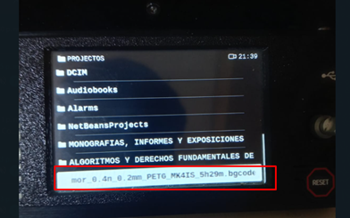  

- Presionar **Imprimir** y verificar que la impresora comience el proceso de calentamiento e impresión.
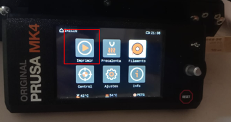  
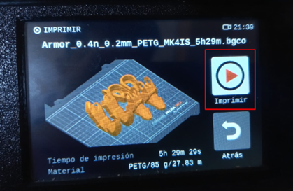  
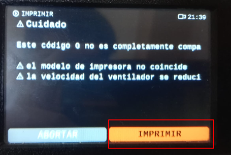  

- Supervisar los primeros minutos de impresión para asegurar una correcta adhesión al lecho de impresión.

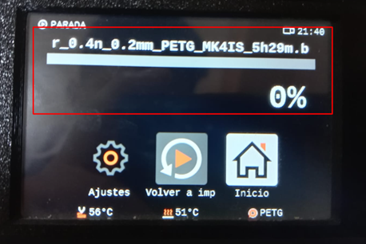  

### 5. Postprocesamiento
- Retirar soportes, lijar o pintar si es necesario.
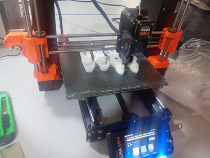  
## 5. Aplicaciones
### Educación
- Prototipos para proyectos escolares o universitarios.
### Industria
- Fabricación rápida de piezas, moldes y herramientas.
### Arte y Diseño
- Modelado personalizado de esculturas, joyas y decoración.
### Medicina
- Prótesis personalizadas y modelos anatómicos.

## 6. Proyectos Ejemplares
- Piezas mecánicas como engranajes o soportes.
- Diseños de productos para revisión previa a producción masiva.
- Figuras anatómicas, mapas topográficos o estructuras moleculares.
- Lámparas, soportes para móviles, decoraciones.
- Brazos robóticos o carcasas para proyectos Arduino.

## 7. Conclusión
- La impresora 3D Prusa es una herramienta poderosa para la fabricación digital.
- Amplias aplicaciones en diferentes campos.
