#### 🖥️ Escribir la Imagen del Sistema Operativo en la Tarjeta microSD  

Lo primero que debemos hacer es preparar el sistema operativo. El **Jetson Nano** utiliza una tarjeta **microSD** como almacenamiento principal.  

---

### 🔹 Paso 1: Preparar la Tarjeta microSD  

1️⃣ **Toma tu lector de tarjetas SD/Micro SD** con conector USB estándar.  
2️⃣ **Introduce la tarjeta microSD de 64 min a 128 GB** en el adaptador.  
3️⃣ **Inserta el adaptador en el lector de tarjetas SD**.  

 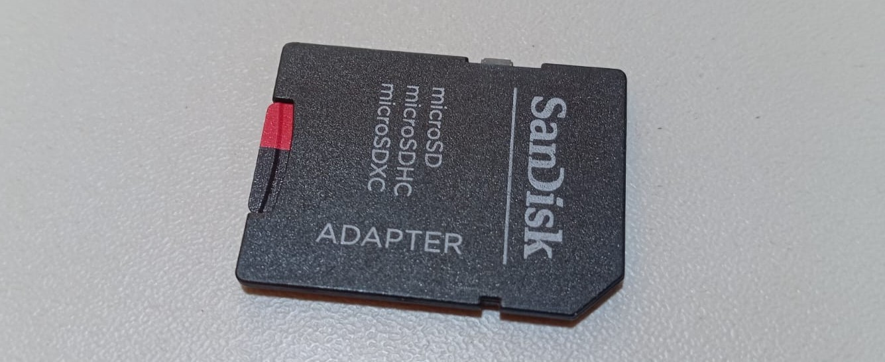  

4️⃣ **Conecta el lector de tarjetas SD a tu PC**.  
5️⃣ **Verifica que el lector aparezca en la lista de discos** en tu PC y anota su letra de unidad (Ejemplo: `F:`).  

 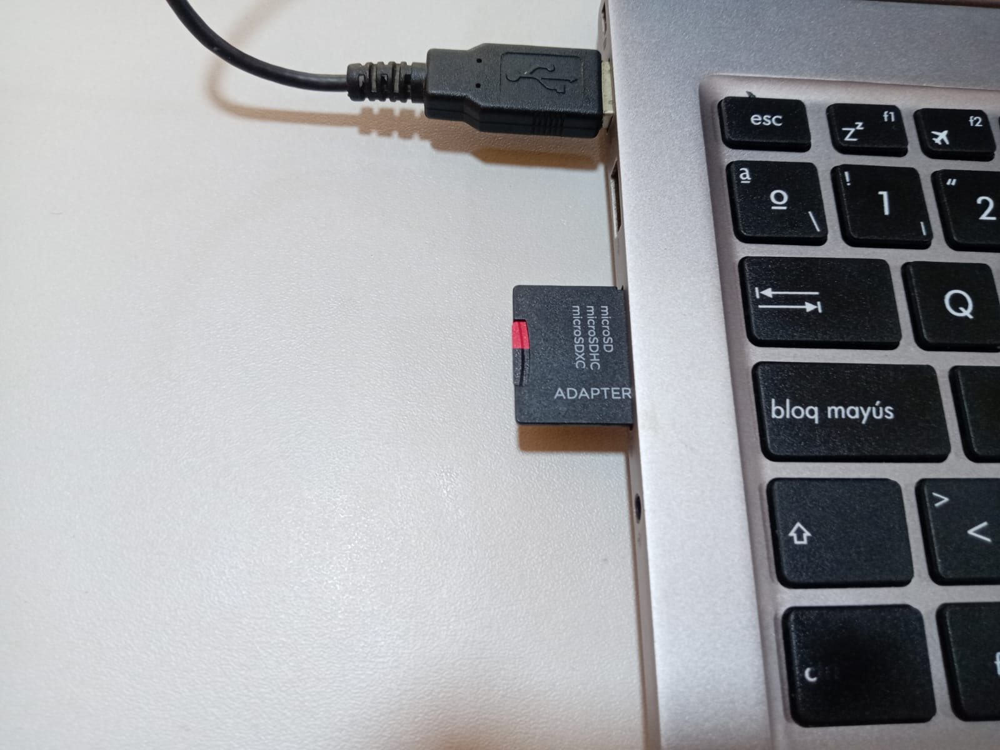  

---

### 🔹 Paso 2: Descargar la Imagen del Sistema  

🔹 Descarga el archivo de imagen de la tarjeta SD del **Jetson Nano Developer Kit** [Descarga el archivo de imagen de la tarjeta SD del Jetson Nano Developer Kit](https://developer.nvidia.com/jetson-nano-sd-card-image)
 (conocido como **JetPack**).  
🔹 Guarda el archivo en una ubicación accesible, como tu escritorio.  

💡 **Nota:** Es un archivo grande, la descarga puede tardar.  

<!-- 📷    -->

---

### 🔹 Paso 3: Formatear la Tarjeta microSD  

🔹 **Para Windows:**  

1️⃣ Descarga, instala y ejecuta el **Formateador de tarjetas SD**.   [Formateador de tarjetas de memoria SD para Windows ](https://www.sdcard.org/downloads/formatter_4/eula_windows/) 
2️⃣ Selecciona la unidad de la tarjeta microSD.  
3️⃣ Activa la opción **"Formato rápido"**.  
4️⃣ Deja **"Etiqueta de volumen"** en blanco.  
5️⃣ Haz clic en **"Formato"** y confirma con **"Sí"**.  
6️⃣ Espera hasta que aparezca la notificación de **formateo exitoso**.  

Aquí están las capturas de pantalla que tomé del proceso:
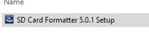  
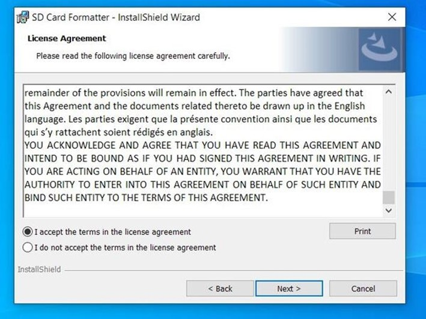  
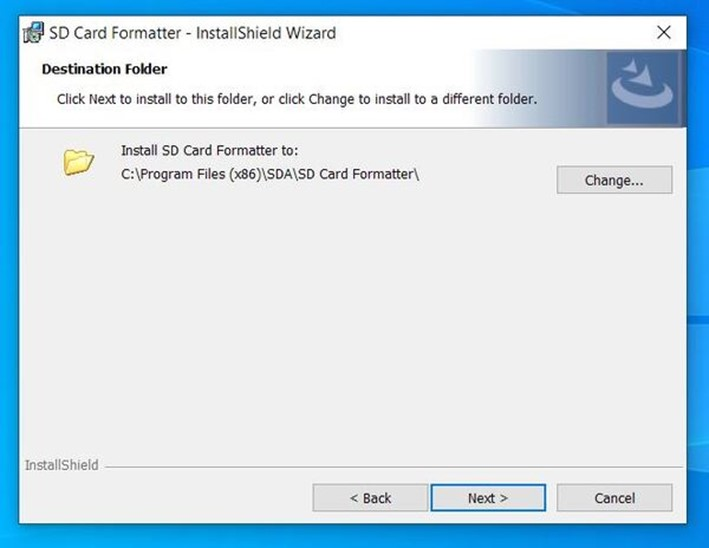  
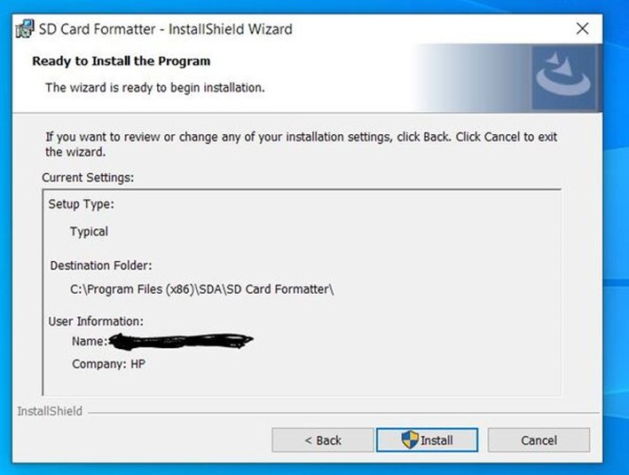  
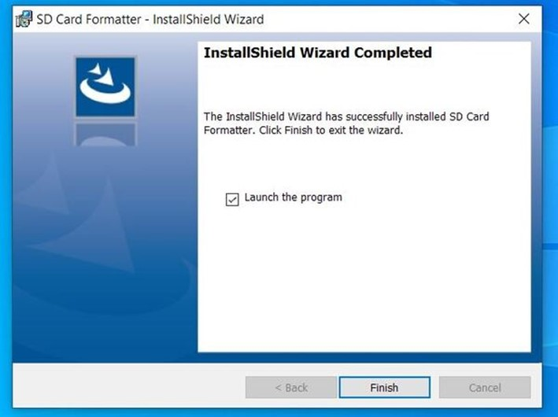  
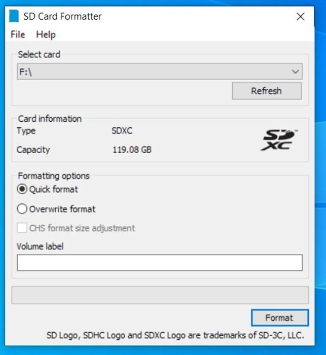  
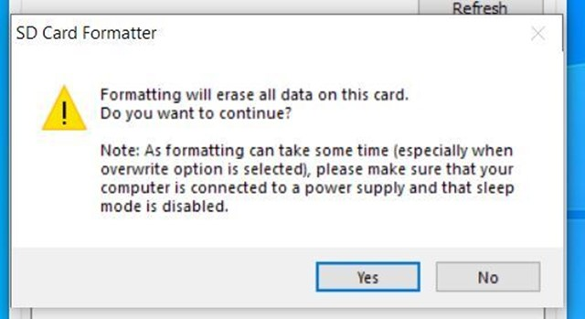  
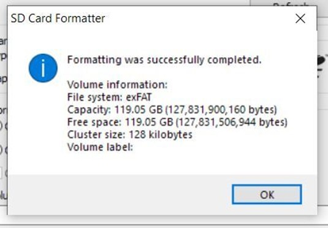  

---

Cuando reciba la notificación de que el formateo se realizó correctamente, cierre todas las ventanas abiertas.

---

### 🔹 Paso 4: Escribir la Imagen en la Tarjeta microSD  

🔹 Descarga, instala y ejecuta **Etcher**.   [Descargando e instalando Etcher ](https://www.balena.io/etcher) 

 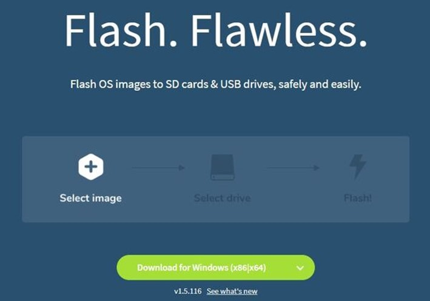  
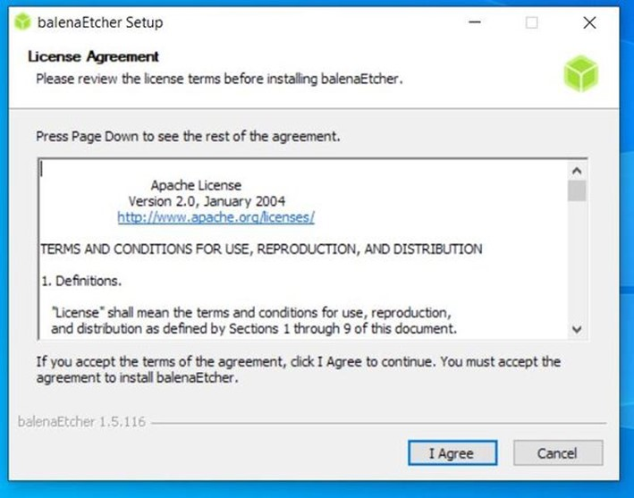  
1️⃣ **Haz clic en "Flash desde archivo"** y selecciona la imagen del Jetson Nano descargada.  

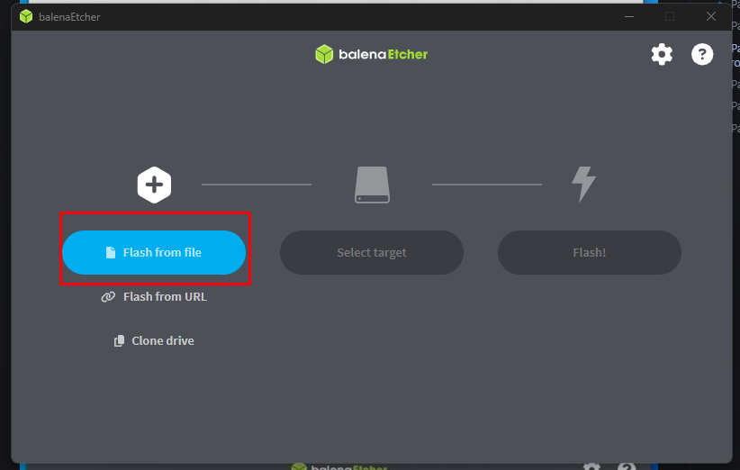  

2️⃣ **Selecciona el destino**, elige la unidad de la tarjeta SD (Ejemplo: `F:`).  

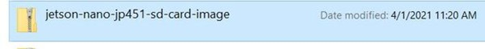  

3️⃣ **Haz clic en "¡Flash!"** y espera a que termine el proceso.  

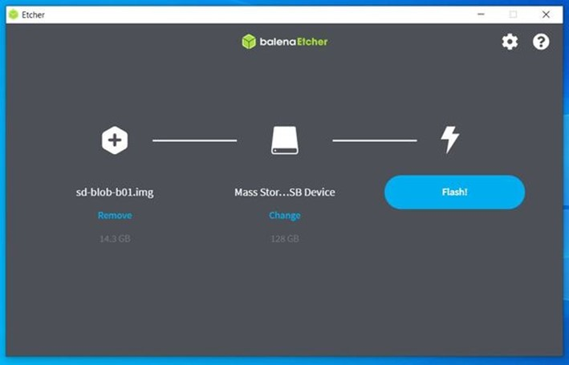  

4️⃣ Una vez finalizado, **ignora cualquier advertencia de Windows** y **extrae la tarjeta microSD**.  

 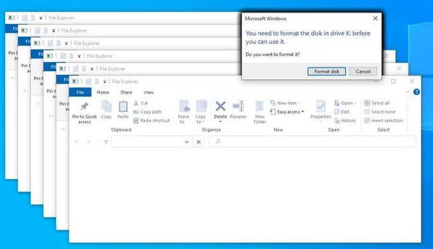  

---

# ⚡ Configuración y Primer Arranque  

### 🔹 Paso 1: Preparar el Jetson Nano  

1️⃣ **Despliega el soporte de papel** y coloca el **Jetson Nano** dentro de la caja del kit de desarrollo.  

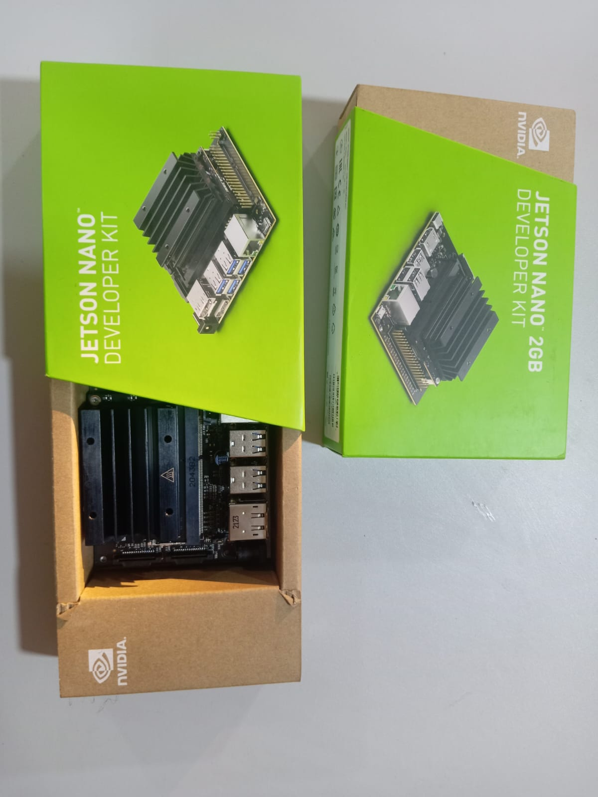  

2️⃣ **Inserta la tarjeta microSD** con la imagen del sistema ya escrita.  

 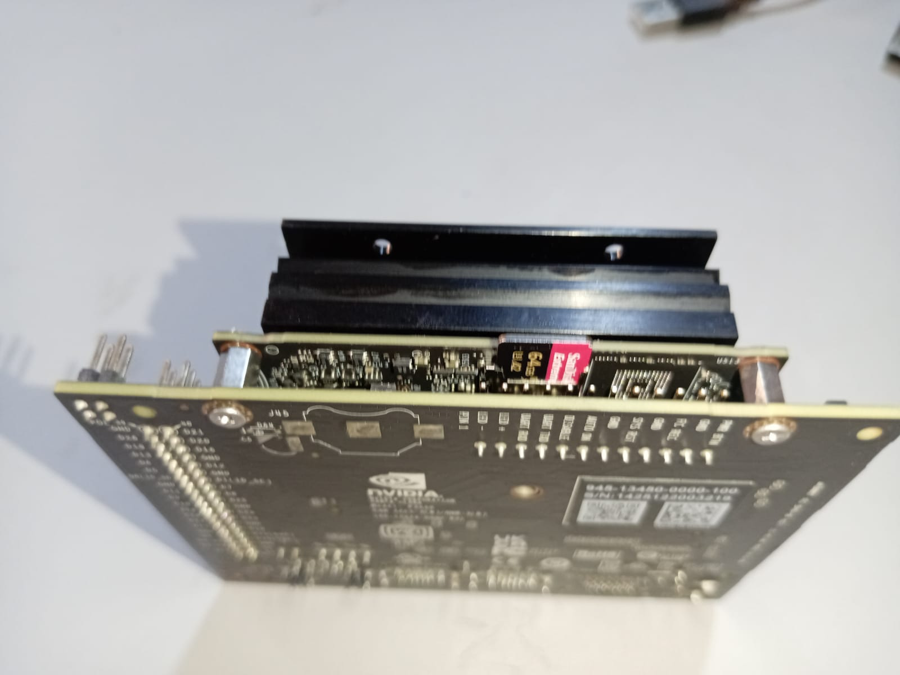  

3️⃣ **Verifica que el puente esté en los pines del cabezal J48**.  

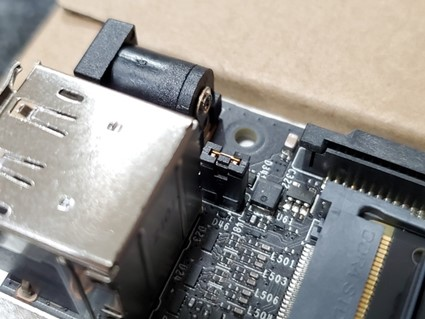  

---

### 🔹 Paso 2: Conectar Periféricos  

1️⃣ **Conecta el Jetson Nano a un monitor** usando un cable HDMI.  

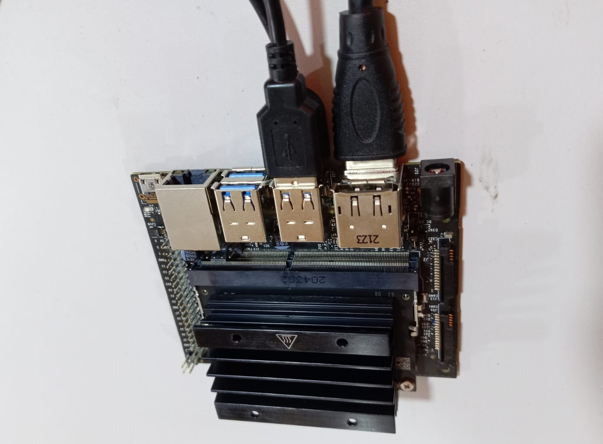  

2️⃣ **Conecta el teclado y el mouse** a los puertos USB del Jetson Nano.  

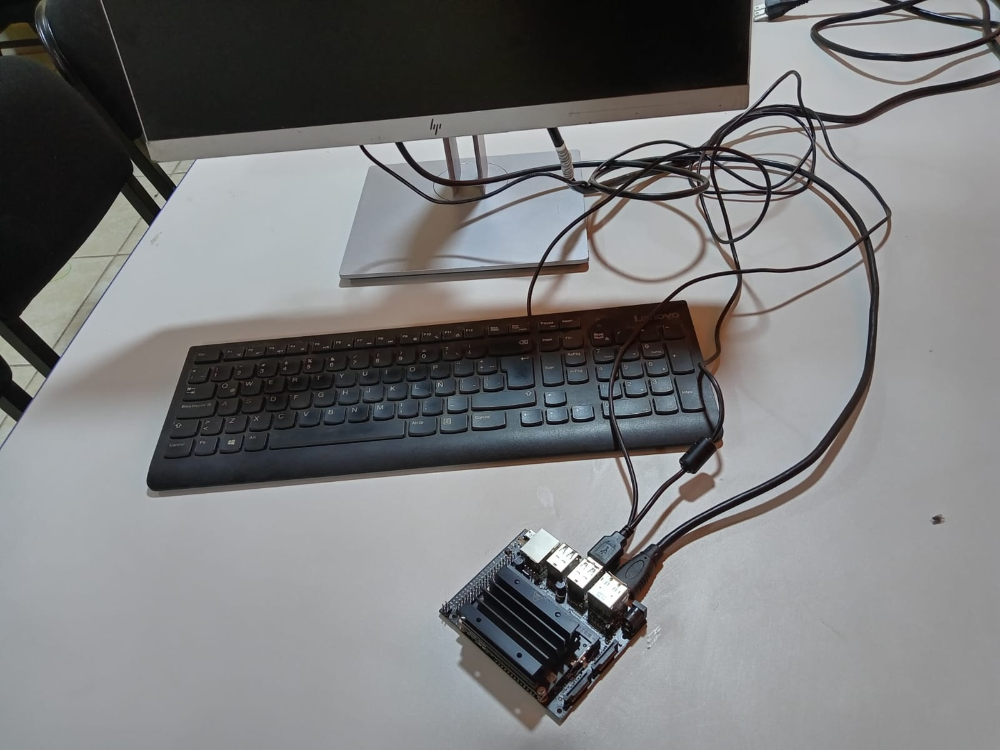  

---

### 🔹 Paso 3: Encender el Jetson Nano  

1️⃣ **Obtén una fuente de alimentación** compatible (5V/4A, OD 5,5 mm, ID 2,1 mm).  
2️⃣ **Conéctala al puerto de alimentación del Jetson Nano**.  

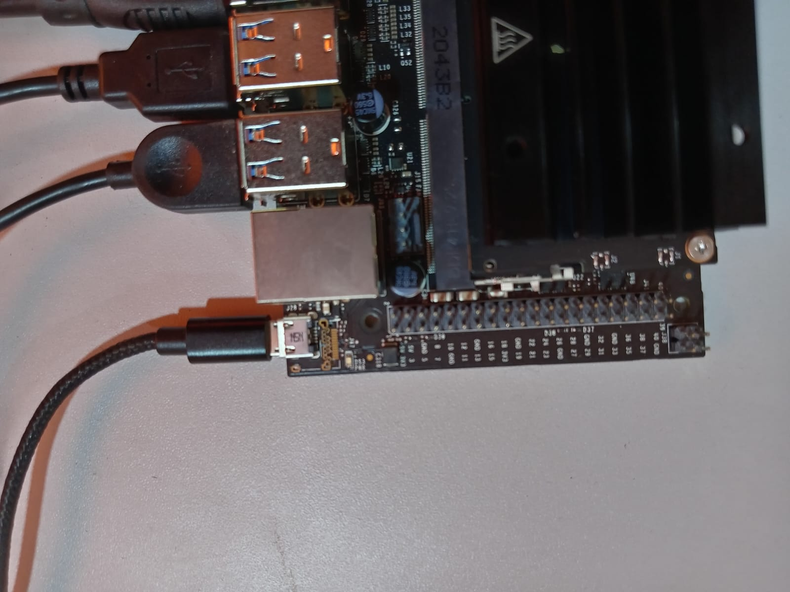  

3️⃣ El **Jetson Nano se encenderá automáticamente**.  
4️⃣ **Espera 1 minuto** hasta que el sistema arranque.  

<!-- 📷    -->

---

💡 **¡Felicidades!** 🎉 Tu Jetson Nano está listo para la configuración inicial. 🚀  

En el siguiente paso, configuraremos **WiFi y las actualizaciones del sistema**.  
