## 1️⃣ Aceptar Acuerdo y Configurar Idioma  

1. **Revise y acepte** el Acuerdo de licencia de usuario final del software NVIDIA Jetson.  
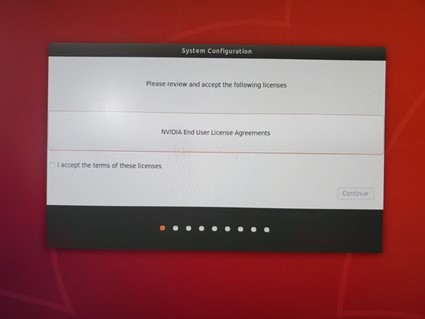  
2. **Seleccione el idioma** del sistema.  
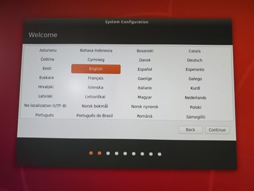  
3. **Seleccione la distribución** del teclado.  
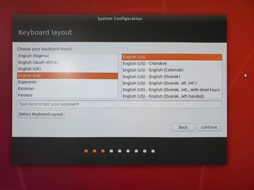  
4. **Elija la zona horaria** adecuada para su ubicación.  
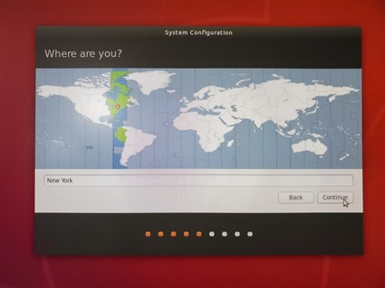  

---

## 2️⃣ Configurar Usuario y Sistema  

1. **Cree un nombre de usuario y contraseña**.  
2. **Asigne un nombre al equipo**.  
3. **Asegúrese de seleccionar** la opción "Iniciar sesión automáticamente".  
4. **Seleccione el tamaño de la partición de la aplicación** (NVIDIA recomienda el tamaño máximo).  

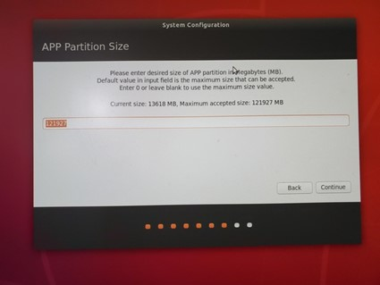   

---

## 3️⃣ Finalizar Configuración  

1. **Actualice el proceso QSPI** y haga clic en **Continuar**. 
    
2. **Mantenga la configuración predeterminada** para el modo **Nvpmodel** y haga clic en **Continuar**.  
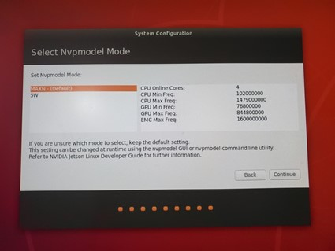   
3. **Su NVIDIA Jetson se reiniciará automáticamente** y cargará el escritorio de Ubuntu.  
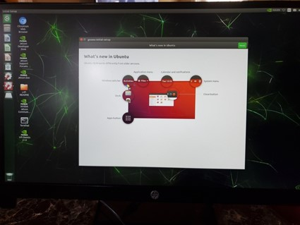   
---

## 4️⃣ Abrir Terminal y Reiniciar  

1. **Haga clic en el icono de Terminal** en la parte inferior izquierda.  
2. **Ejecute el siguiente comando para reiniciar**:  

```bash
sudo reboot
```

## Configurar WiFi

1. Conéctate a una red WiFi usando el **Adaptador USB WiFi**.
2. Abre la **terminal** y ejecuta:

```sh
nmcli d wifi list
nmcli d wifi connect "Nombre_WiFi" password "Tu_Contraseña"
```

---

## Ejecutar actualizaciones

```sh
sudo apt-get update
sudo apt-get upgrade -y
sudo reboot
```

---

## Recopilar información sobre su Jetson Nano

```sh
hostname -I
```

Anota la **dirección IP interna** de tu dispositivo.

---

## Cambiar la configuración de la fuente de alimentación

Verificar el **modo de energía**:
```sh
sudo nvpmodel -q
```
Si no está en **MAXN**, cambiarlo:
```sh
sudo nvpmodel -m 0  # Máximo rendimiento
sudo nvpmodel -m 1  # Bajo consumo (si usas microUSB)
```

---

## Crear un archivo de intercambio

Algunas de las aplicaciones que usaré en mi Jetson Nano requieren mucha memoria. Para evitar que el Nano se bloquee, necesitamos crear un archivo de intercambio.

Verificar si hay **espacio de intercambio**: 
```sh
free -h
```
Si no hay, crear un **swapfile de 4GB**:
```sh
sudo fallocate -l 4G /var/swapfile
sudo chmod 600 /var/swapfile
sudo mkswap /var/swapfile
sudo swapon /var/swapfile
sudo bash -c 'echo "/var/swapfile swap swap defaults 0 0" >> /etc/fstab'
```
Reiniciar el **Jetson Nano**:
```sh
sudo reboot
```
Después del reinicio, verificar nuevamente:
```sh
free -h
```

---

## Conéctese a su NVIDIA Jetson Nano de forma remota desde su PC
Ahora te mostraré todo lo que necesitas saber para conectarte a tu escritorio NVIDIA Jetson Nano de forma remota desde tu propia PC (en la misma red WiFi) usando una aplicación llamada VNC Viewer.

---


## 🖥️ Conéctate a Tu NVIDIA Jetson Nano Remotamente

### 🔹 Requisitos
- NVIDIA Jetson Nano
- PC con Windows, macOS o Linux
- Conexión a la misma red WiFi
- Software VNC Viewer o NoMachine

---

## 🚀 Optimiza el Uso de RAM con LXDE

### 🔧 Cambiar a LXDE Desktop
```bash
echo $DESKTOP_SESSION
```
1. En la pantalla de inicio de sesión, haz clic en el **ícono de engranaje**.
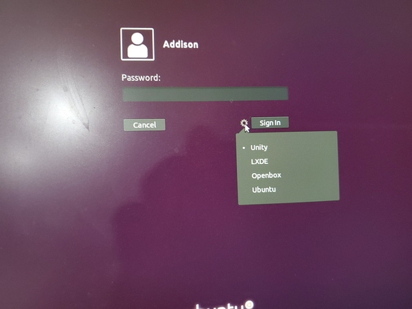   
2. Selecciona **LXDE**.
3. Ingresa tu contraseña y haz clic en **Iniciar sesión**.
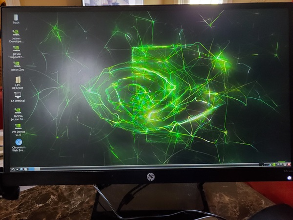   

### 🔄 Reinicia el sistema
```bash
sudo reboot
```
Verifica el entorno de escritorio activo:
```bash
echo $XDG_CURRENT_DESKTOP
```
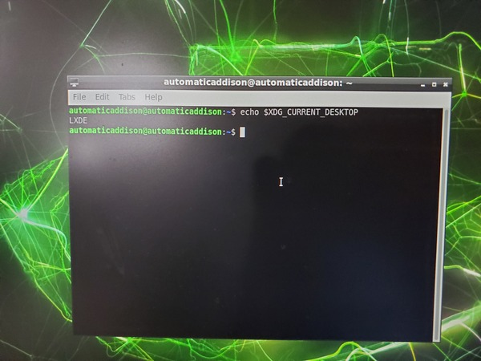   
### 📉 Verifica la memoria libre
```bash
free
```
  
### 🔄 Cambiar el gestor de pantalla a `lightdm`
```bash
sudo dpkg-reconfigure lightdm
```
1. Aparecerá una ventana emergente.
2. Presiona **Enter** y selecciona `lightdm`.
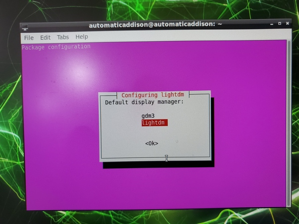   

### 🔄 Reinicia el sistema nuevamente
```bash
sudo reboot
```
Verifica el uso de memoria con:
```bash
free
```
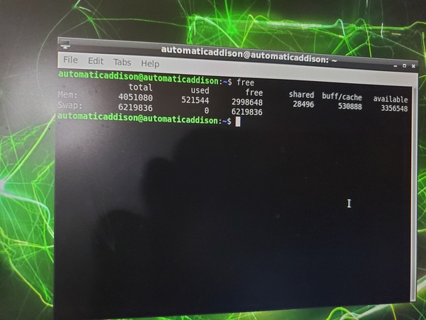  

---

## 🔌 Configurar el Servidor VNC

### 🔹 Habilitar el VNC Server al inicio
```bash
mkdir -p ~/.config/autostart
cp /usr/share/applications/vino-server.desktop ~/.config/autostart/.
```

### 🔒 Configurar el Servidor VNC
```bash
gsettings set org.gnome.Vino prompt-enabled false
gsettings set org.gnome.Vino require-encryption false
gsettings set org.gnome.Vino authentication-methods "['vnc']"
gsettings set org.gnome.Vino vnc-password $(echo -n 'tucontraseña'|base64)
```
> Reemplaza `'thepassword'` con tu contraseña deseada.

### 🔄 Apaga el Jetson Nano
```bash
sudo shutdown -h now
```
1. **Desconecta** teclado, ratón y monitor.
2. **Vuelve a conectar** la fuente de alimentación.

---

## 💻 Instalar un Software de Escritorio Remoto

### 🐢 Opción 1: VNC Viewer (Más Lento)
1. Descarga e instala **VNC Viewer** en tu PC. [Estas instrucciones que cubren Windows, MacOs y Linux.](https://developer.nvidia.com/embedded/learn/tutorials/vnc-setup#h.3l6vhucxuhtg).

2. Abre VNC Viewer y escribe la **IP de tu Jetson Nano**.
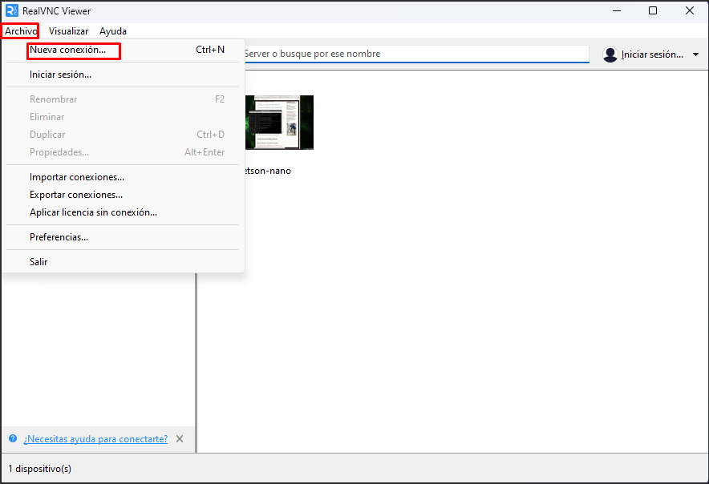 
  

3. Ingresa la contraseña configurada.

4. Ajusta la resolución en: **Preferences → Monitor Settings**.
5. Para apagar:
```bash
sudo shutdown -h now
```

### ⚡ Opción 2: NoMachine (Más Rápido)
1. Descarga el **paquete DEB** para `ARMv8` desde [NoMachine](https://www.nomachine.com/download/).
2. Mueve el archivo a la carpeta de descargas:
```bash
cd Downloads
```
3. Instala NoMachine:
```bash
sudo dpkg -i nomachine_7.4.1_1_arm64.deb
```
4. Abre el menú de inicio y selecciona **NoMachine**.
5. Copia la **URL de conexión**.
6. Reinicia el Jetson Nano:
```bash
sudo shutdown -h now
```
7. Descarga NoMachine en tu PC y ábrelo.
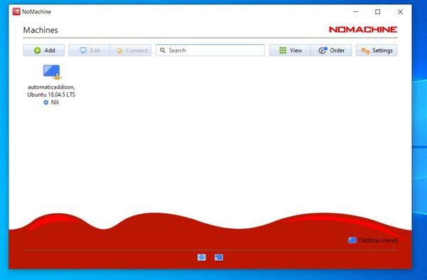  
8. Haz doble clic en el **icono del Jetson Nano**. 
9. Ingresa tu usuario y contraseña.

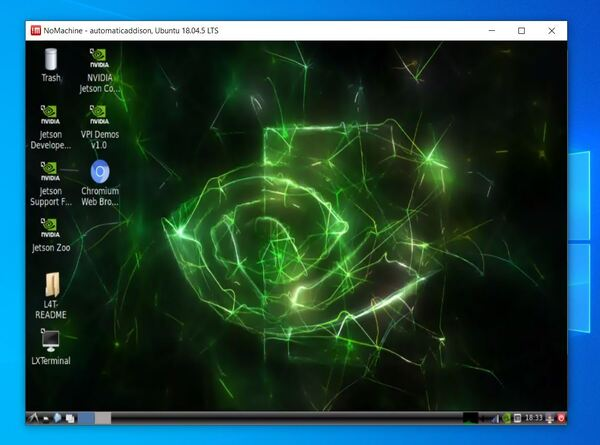  
10. ¡Listo! Ahora puedes controlar tu Jetson Nano remotamente.

---

## 🔑 Conectar a la Terminal del Jetson Nano con Putty (Opcional)

### 🖥️ Instalación de Putty
1. Descarga **Putty** desde [putty.org](https://www.putty.org/).
2. Instálalo y ábrelo.
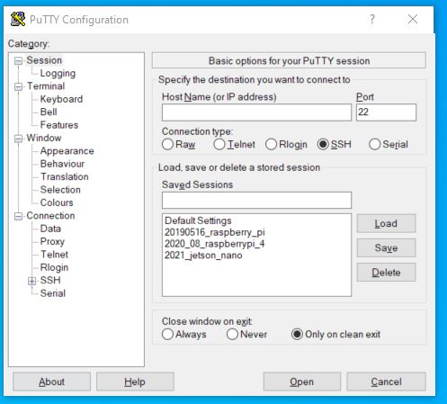  
3. Ingresa la **IP de tu Jetson Nano**.
4. Selecciona **SSH** y haz clic en **Open**.
5. Si aparece un mensaje de advertencia, haz clic en **Yes**.
6. Ingresa tu **usuario y contraseña**.

✅ ¡Ya puedes acceder al terminal del Jetson Nano desde tu PC!

---

## 🎯 Conclusión
- **LXDE** mejora el rendimiento del Jetson Nano.
- **VNC Viewer** es una opción sencilla pero lenta.
- **NoMachine** ofrece mejor rendimiento.
- **Putty** es útil para acceso por terminal.

🚀 ¡Ahora puedes controlar tu Jetson Nano de forma remota y eficiente! 🎉
