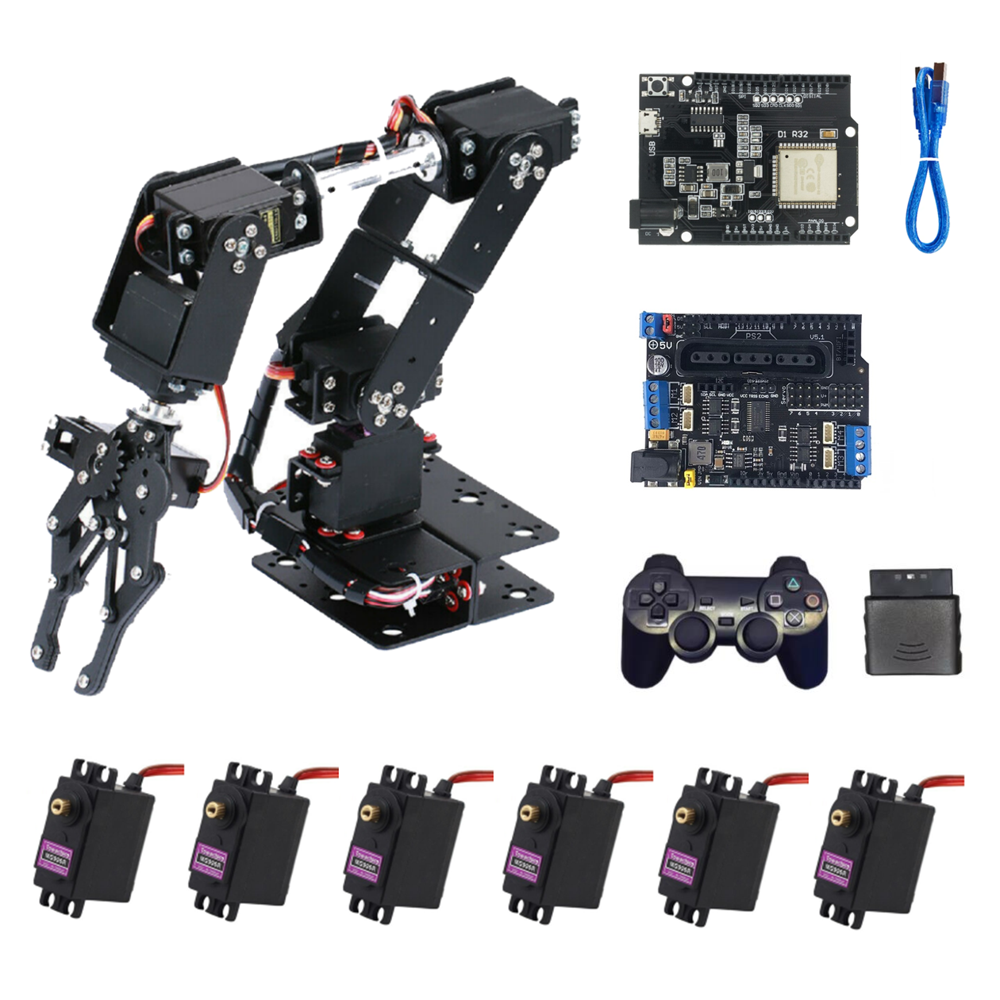
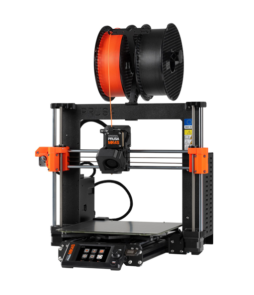
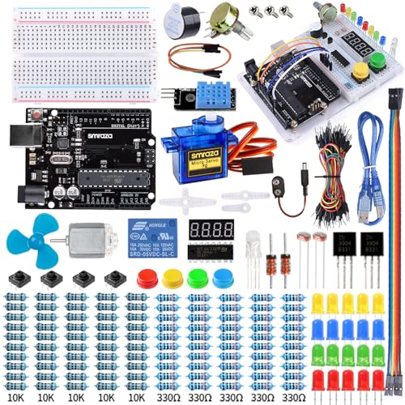
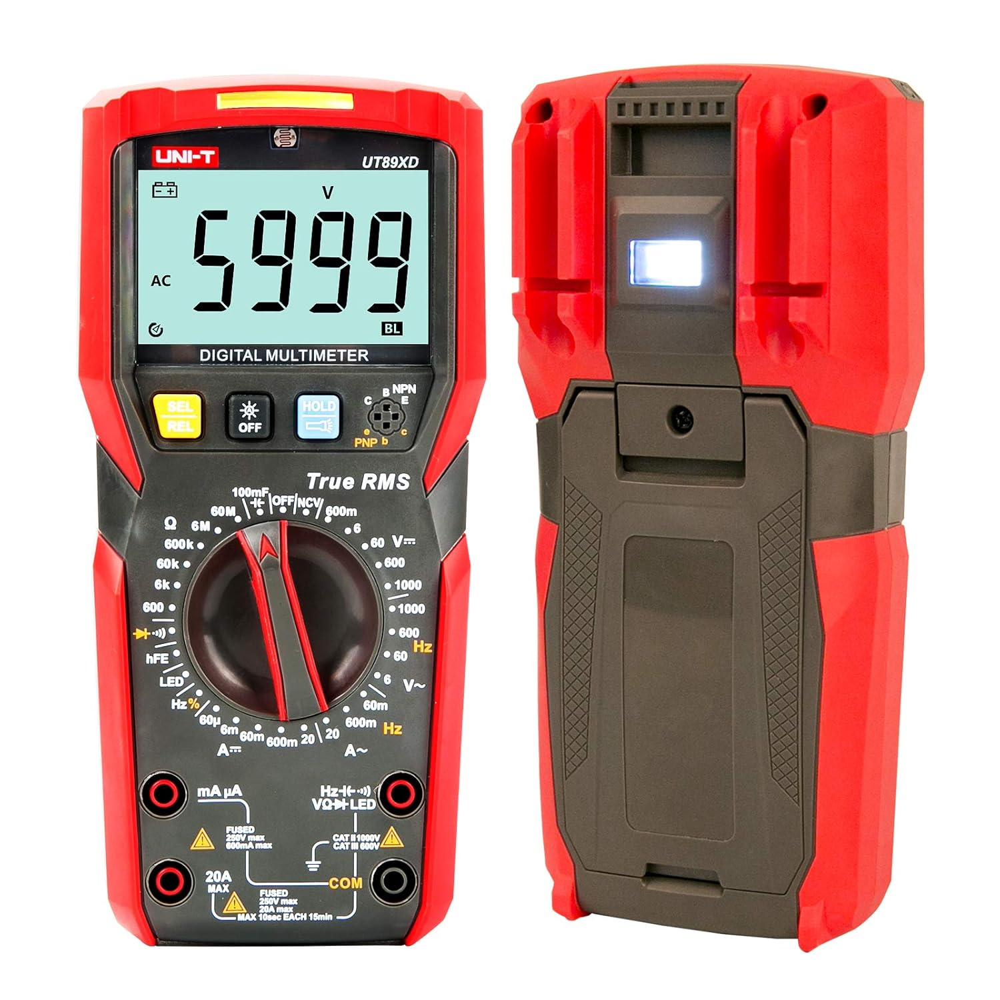
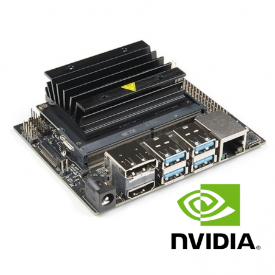
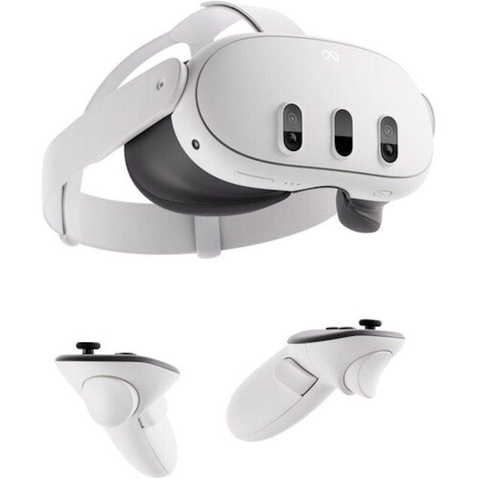
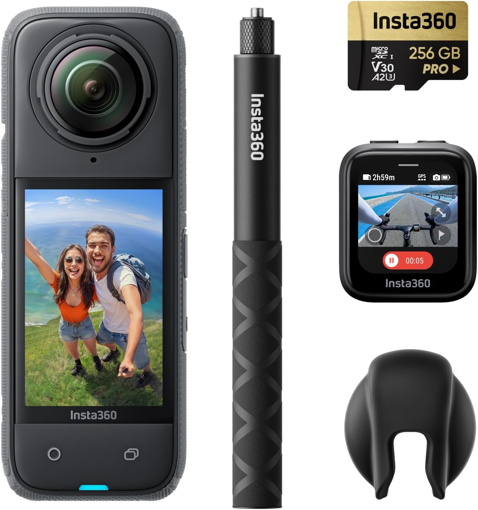
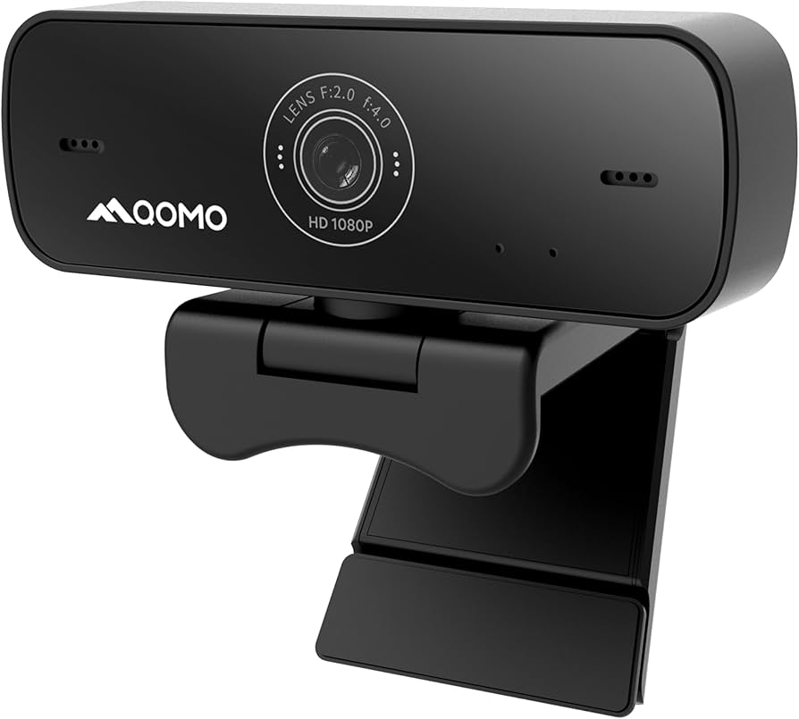
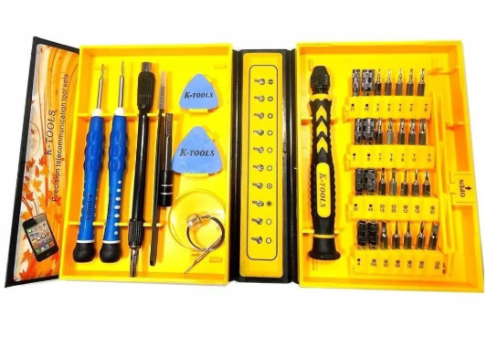

Bienvenidos al **Laboratorio de IoT e Inteligencia Artificial**. Somos un espacio de innovación tecnológica enfocado en el desarrollo, experimentación y aplicación de tecnologías emergentes en el ámbito de la **inteligencia artificial, robótica, impresión 3D y realidad mixta**.

## 🎯 ¿Qué hacemos?

🔹 Desarrollo de soluciones en **Internet de las Cosas (IoT)**  
🔹 Investigación y pruebas con **Inteligencia Artificial** aplicada  
🔹 Creación de prototipos con **impresión 3D**  
🔹 Desarrollo de proyectos con **robótica avanzada**  
🔹 Exploración de entornos inmersivos con **realidad virtual y mixta**  

## 🏢 Nuestro equipamiento

A continuación, te presentamos nuestro equipamiento en una tabla con imágenes:

| Equipo | Descripción | Imagen |
|--------|------------|--------|
| **Brazo Robótico** | 2 brazos de 6 grados de libertad para automatización y manipulación |  |
| **Impresoras 3D** | Prusa y Ender para prototipado rápido y fabricación digital |  |
| **Filamentos de colores** | Materiales de impresión 3D en diversos colores y tipos |  |
| **Arduinos y componentes** | Desarrollo de hardware y proyectos de IoT |  |
| **Multímetros** | Equipos de medición para pruebas electrónicas |  |
| **Jetson Developer Kits** | 10 kits para procesamiento de IA en el borde (Edge AI) |  |
| **Lentes VR Oculus Quest 3** | Para experiencias inmersivas y simulaciones |  |
| **Cámara Insta360 X4** | Captura de entornos en 360° y modelado 3D |  |
| **Cámara Webcam** | Para videoconferencias y monitoreo |  |
| **Llaves y herramientas** | Kits de herramientas para ensamblaje y reparación |  |

## 🚀 ¿Por qué elegirnos?

🔹 **Innovación**: Aplicamos las últimas tecnologías en nuestros proyectos.  
🔹 **Experiencia**: Contamos con un equipo experto en múltiples disciplinas tecnológicas.  
🔹 **Colaboración**: Trabajamos con universidades, startups y empresas en soluciones tecnológicas.  
🔹 **Escalabilidad**: Desarrollamos soluciones adaptadas a necesidades reales y de alto impacto.  

## 📩 ¡Contáctanos!
Si estás interesado en colaborar, invertir o desarrollar un proyecto con nosotros, no dudes en contactarnos.

📧 **Correo:** arivera@undc.edu.pe
🌐 **Sitio Web:** [www.laboratorioiot-ia.com](https://iot-ia.vercel.app/)  
📍 **Ubicación:** Cañete, Lima, Peru
