import { Aside, Card, CardGrid, Tabs, TabItem, Badge } from '@astrojs/starlight/components';

Bienvenidos al **Laboratorio de IoT e Inteligencia Artificial (IA)**.  
Somos un espacio de **innovación tecnológica** enfocado en el desarrollo, experimentación y aplicación de tecnologías emergentes en el ámbito de la **IA, robótica, impresión 3D e inmersión virtual**.

<Aside type="tip">
💡 Aquí potenciamos la **creatividad y la tecnología** para transformar ideas en soluciones reales.
</Aside>

---

## 🎯 ¿Qué hacemos?

<Card title="Áreas de especialización" icon="rocket">
- Desarrollo de soluciones en **Internet de las Cosas (IoT)**
- Investigación y pruebas con **Inteligencia Artificial**
- Creación de prototipos con **impresión 3D**
- Desarrollo de proyectos con **robótica avanzada**
- Exploración de entornos inmersivos con **realidad virtual y mixta**
</Card>

---

## 🏢 Nuestro Equipamiento

<CardGrid>
  <Card title="🤖 Brazo Robótico" icon="cpu">
    <Badge text="2 unidades" color="purple" />  
    6 grados de libertad para **automatización y manipulación**.  
    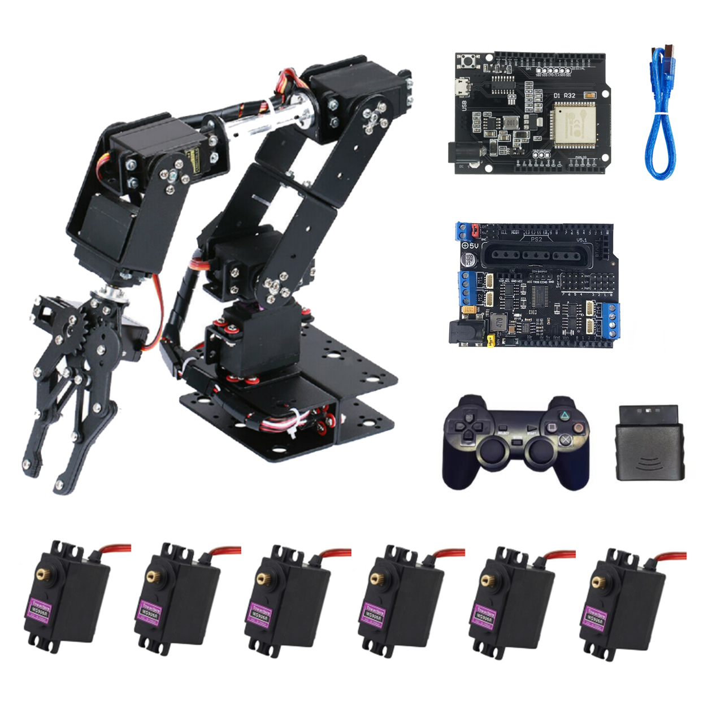
  </Card>

  <Card title="🖨️ Impresoras 3D" icon="printer">
    Prusa y Ender para **prototipado rápido**.  
    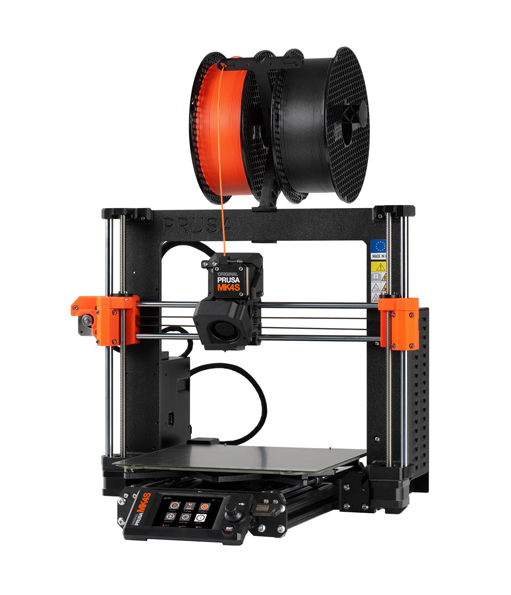
  </Card>

  <Card title="🎨 Filamentos" icon="palette">
    Colores y materiales diversos para impresión 3D.  
    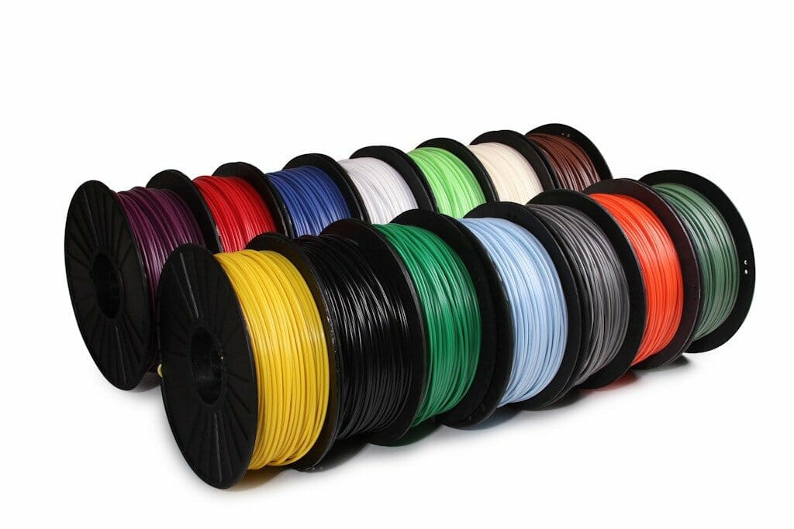
  </Card>

  <Card title="🔌 Arduinos" icon="circuit-board">
    Kits y sensores para proyectos de **IoT**.  
    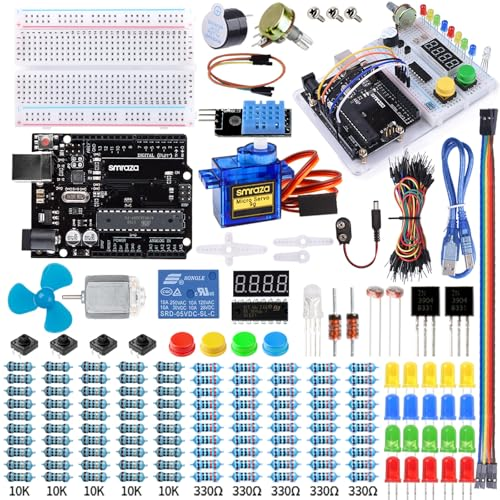
  </Card>

  <Card title="📟 Multímetros" icon="activity">
    Herramientas de **medición electrónica**.  
    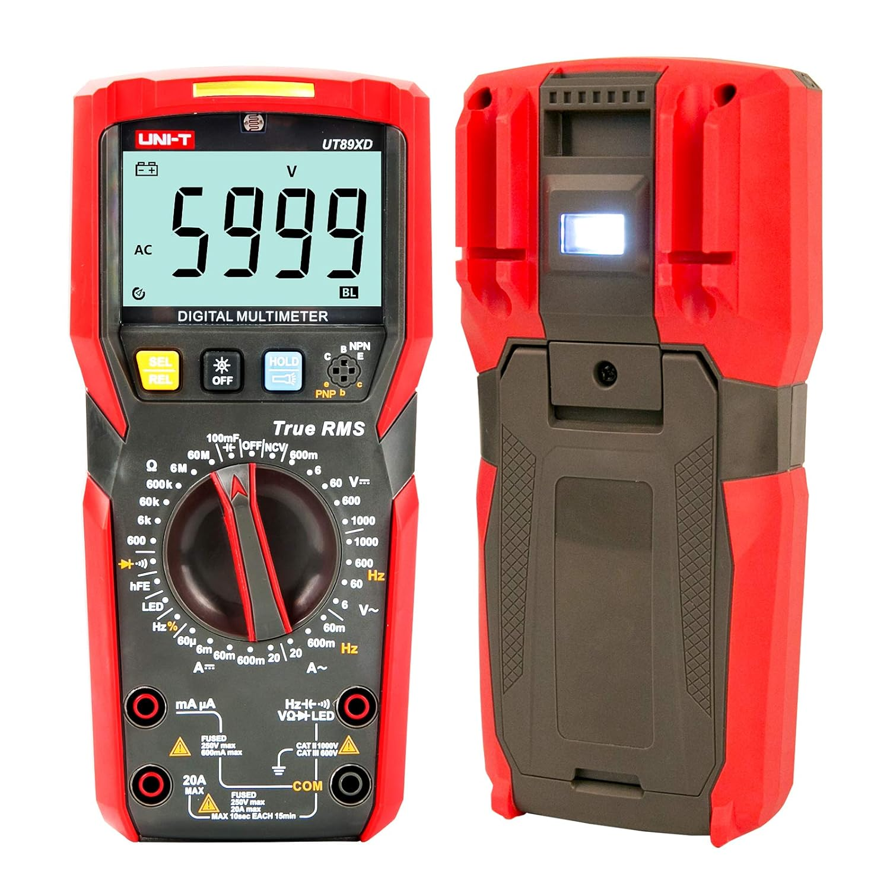
  </Card>

  <Card title="🧠 Jetson Kits" icon="server">
    <Badge text="10 kits" color="blue" />  
    Procesamiento de **IA en el borde (Edge AI)**.  
    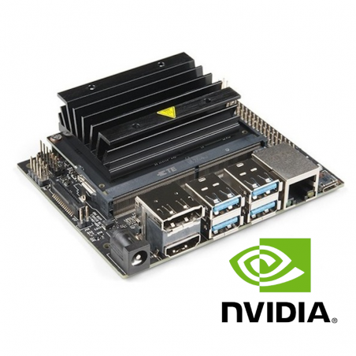
  </Card>

  <Card title="🌐 Lentes VR Oculus Quest 3" icon="vr">
    Experiencias inmersivas y simulaciones.  
    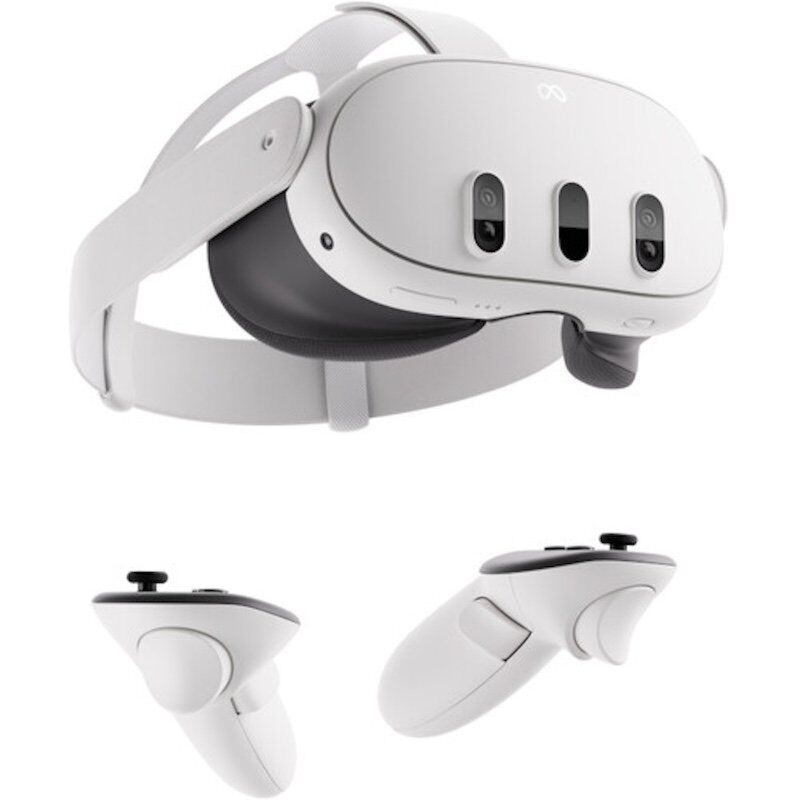
  </Card>

  <Card title="📷 Cámara Insta360 X4" icon="camera">
    Captura de entornos en **360°**.  
    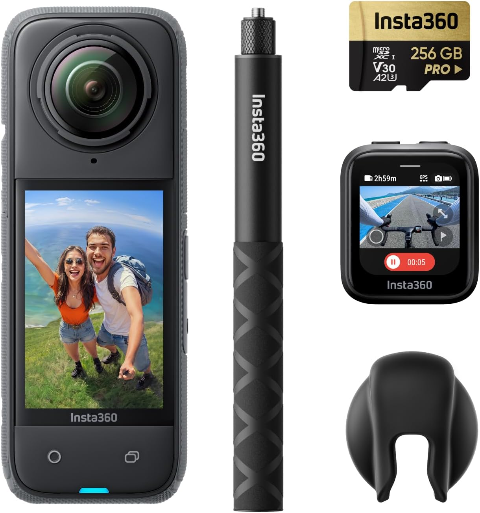
  </Card>

  <Card title="🪚 Cortadora Láser CO2 80W 9060" icon="zap">
    Corte y grabado de MDF, acrílico y cuero.  
    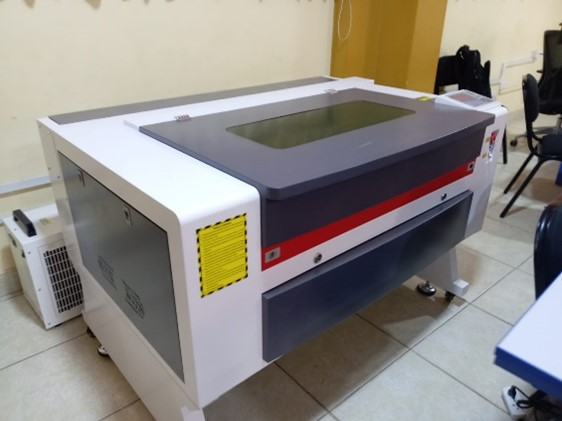
  </Card>

  <Card title="💻 Cámara Webcam" icon="video">
    Para videoconferencias y **monitoreo**.  
    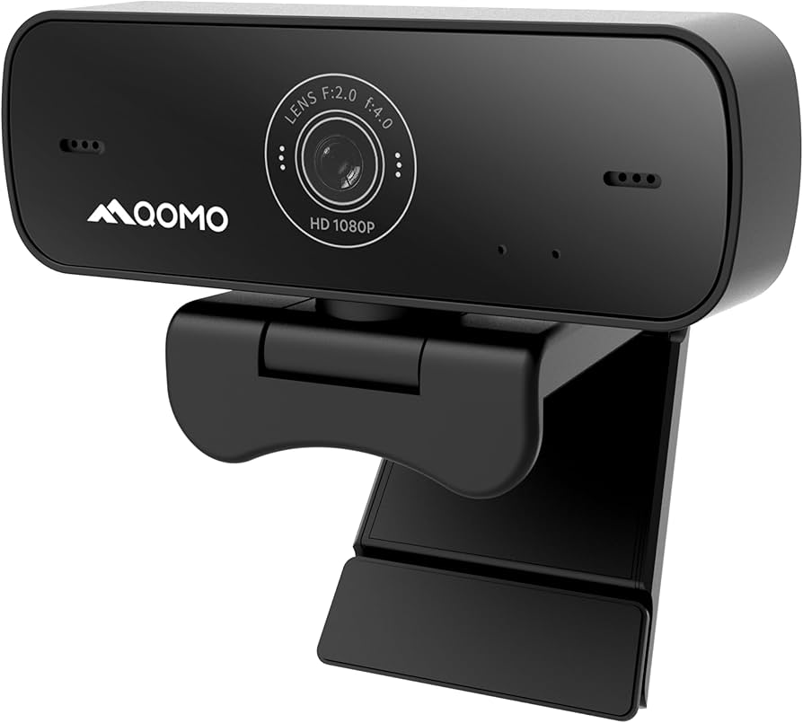
  </Card>

  <Card title="🛠️ Herramientas" icon="wrench">
    Llaves y kits de reparación.  
    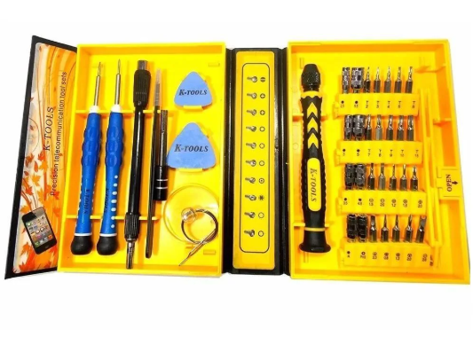
  </Card>
</CardGrid>

---

## 🚀 ¿Por qué elegirnos?

<Aside type="note" title="Ventajas del laboratorio">
🔹 **Innovación** → Aplicamos tecnologías de vanguardia.  
🔹 **Experiencia** → Equipo experto en IA, IoT y robótica.  
🔹 **Colaboración** → Con universidades, startups y empresas.  
🔹 **Escalabilidad** → Soluciones con impacto real.  
</Aside>

---

## 📩 ¡Contáctanos!

<Card title="📞 Contacto Directo" icon="mail">
📧 **Correo:** [arivera@undc.edu.pe](mailto:arivera@undc.edu.pe)  
🌐 **Sitio Web:** [www.laboratorioiot-ia.com](https://iot-ia.vercel.app/)  
📍 **Ubicación:** Cañete, Lima, Perú  
</Card>

---

✨ **En el Laboratorio de IoT e IA, creemos que el futuro se construye hoy.**  
